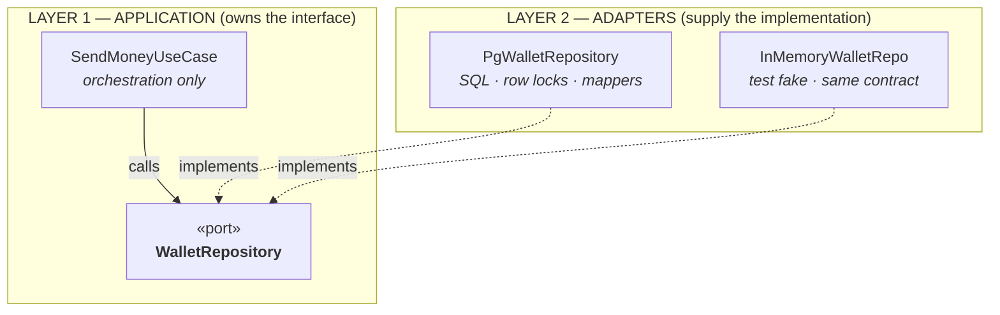
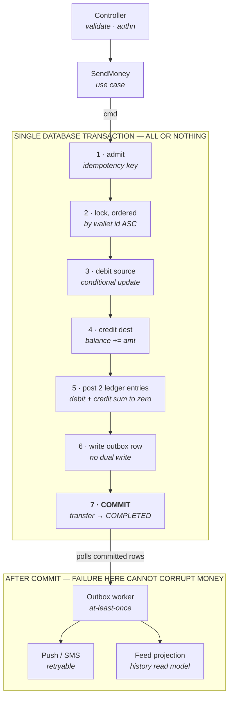
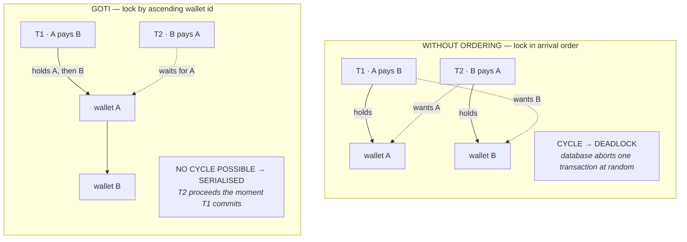
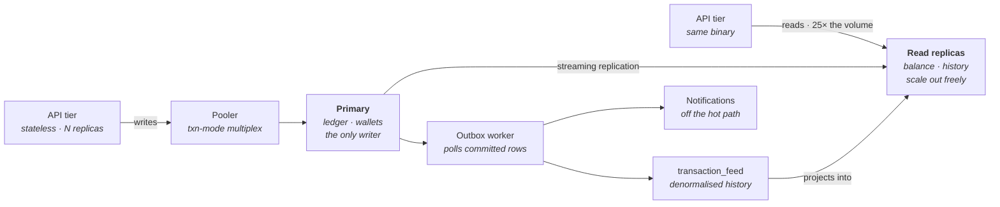

# Goti — Architecture

> **Goti** (গতি, *motion*) is a digital money movement platform. Not a banking system.
> Users hold fake wallets seeded with 100,000 BDT and can send money, request money, and view transaction history.

| | |
|---|---|
| **Domain** | Digital money movement |
| **Currency** | BDT, stored as integer poisha |
| **Status** | Design, pre-implementation |
| **Patterns** | Clean Architecture · Layered Architecture · Repository Pattern · Service Pattern |
| **Revision** | 2026-08-29 |

---

## Contents

1. [What actually makes this hard](#1-what-actually-makes-this-hard)
2. [The architectural stance](#2-the-architectural-stance)
3. [The layer map](#3-the-layer-map)
4. [Responsibilities, role by role](#4-responsibilities-role-by-role)
5. [The Transaction Engine](#5-the-transaction-engine)
6. [Data model and invariants](#6-data-model-and-invariants)
7. [Concurrency and failure modes](#7-concurrency-and-failure-modes)
8. [Scaling to ten million users](#8-scaling-to-ten-million-users)
9. [Changing the database](#9-changing-the-database)
10. [Testing strategy](#10-testing-strategy)
11. [Why not MVC CRUD](#11-why-not-mvc-crud)
12. [Scope and honest limits](#12-scope-and-honest-limits)

---

## 1. What actually makes this hard

Goti has three user-facing features and one genuinely difficult engineering problem. Everything in this document exists to serve the difficult one.

Send money, request money, view history. Written as CRUD, that is an afternoon of work: three tables, three controllers, done. The reason it is not an afternoon of work is that **a balance is not a field you edit**. It is a claim about the sum of everything that has ever happened to a wallet, and every one of the following will break a naive implementation.

| # | Constraint | Why a naive design fails |
|---|---|---|
| **C1** | **Lost update** | Two requests read a balance of 100, each subtracts 60, each writes back 40. The wallet spent 120 it did not have. Read-modify-write in application code is the bug, not the fix. |
| **C2** | **Deadlock** | Two transfers touching the same pair of wallets in opposite order form a lock cycle. The database resolves it by killing one transaction — under load, at random, at the worst moment. |
| **C3** | **Retries** | A timeout is not a failure; it is an unknown. Mobile clients retry. Without idempotency, a retried send is a second send, and the user is charged twice for one action. |
| **C4** | **Partial writes** | A crash between the debit and the credit destroys money. Debit, credit, ledger entries and the outbox row must commit as one unit or not at all. |
| **C5** | **Auditability** | A mutable balance column cannot answer "why is my balance this?". History is not a report generated from state; history *is* the state, and the balance is derived from it. |
| **C6** | **Read pressure** | People check balances far more often than they send money — roughly 25:1. If the read path and the write path share a model, the cheap operation drags down the expensive one. |

> **The architecture below is, almost entirely, a set of decisions about where each of these six constraints is enforced — and about making sure each is enforced in exactly one place.**

---

## 2. The architectural stance

Clean Architecture and Layered Architecture are often presented as alternatives. They are not. They answer different questions, and Goti uses both because it needs both answers.

### Layered architecture answers: what calls what?

It gives the system a vertical shape. A request enters at the top and travels down through presentation, application, domain and persistence. This is the **runtime call flow**, and it is what makes the codebase navigable — any engineer can predict where a piece of logic lives from the shape of the request.

### Clean architecture answers: what may know about what?

It adds one constraint on top of the stack — the **Dependency Rule**: source-code dependencies may only point inward, toward the domain. Calls go down; dependencies go up. The domain layer imports nothing. Not the ORM, not the HTTP framework, not the config loader.

Layering without the Dependency Rule degrades within weeks: a "service" imports the ORM model, the ORM model grows a business method, and the domain is now welded to Postgres. The Dependency Rule without layering gives correct direction but no shared vocabulary for where things go. Together they produce a codebase where *where* code lives and *what it may touch* are both unambiguous.

The **Repository Pattern** and the **Service Pattern** are how that constraint is implemented in code. Repositories invert the dependency on the database; services — use-case interactors — hold the orchestration that would otherwise leak into controllers. Neither is decoration: remove either one and the Dependency Rule becomes unenforceable.

---

## 3. The layer map

### Figure 1 — the dependency rule

Calls travel down the stack; source-code dependencies point back up it. The domain sits at the bottom of the call flow and the top of the dependency chain, which is what lets it be compiled, reasoned about and tested with nothing else present.

```
                 ┌──────────────────────────────────────────────────────────┐
   RUNTIME       │ L3  INFRASTRUCTURE & FRAMEWORKS                          │
   CALL FLOW     │     HTTP server · Postgres driver · connection pool      │
       │         │     DI container · config · migrations                   │
       │         └──────────────────────────────────────────────────────────┘
       │                                                          ▲
       │                                                   depends on
       │         ┌──────────────────────────────────────────────────────────┐
       │         │ L2  INTERFACE ADAPTERS                                   │
       │         │     Controllers · DTO mappers · repository impls         │
       │         │     ORM rows · outbox worker                             │
       │         └──────────────────────────────────────────────────────────┘
       │                                                          ▲
       │                                                   depends on
       │         ┌──────────────────────────────────────────────────────────┐
       │         │ L1  APPLICATION — use cases & ports                      │
       │         │     SendMoney · RequestMoney · AcceptRequest             │
       │         │     GetHistory · Transaction Engine                      │
       │         └──────────────────────────────────────────────────────────┘
       │                                                          ▲
       │                                                   depends on
       ▼         ╔══════════════════════════════════════════════════════════╗
                 ║ L0  DOMAIN — pure, zero imports                          ║
                 ║     Money · Wallet · Transfer · MoneyRequest             ║
                 ║     LedgerEntry · invariants · state machines            ║
                 ╚══════════════════════════════════════════════════════════╝

                 L0 depends on nothing — no framework, no database, no clock
```

### Figure 2 — dependency inversion at the persistence boundary

The mechanism that makes those two directions compatible is dependency inversion at every boundary. The interface a use case calls is *owned by the use case's layer*; the class that satisfies it lives one layer out.



The same seam serves three purposes at once: tests run without a database, the storage engine can be replaced without touching business logic, and the Repository Pattern gets a reason to exist beyond convention. Swapping Postgres for a sharded cluster replaces one box on the bottom row — **no code in L0 or L1 changes.**

### What lives in each layer

#### L0 · Domain

Entities, value objects, domain errors, and the rules that hold regardless of how the system is deployed. `Money` is a value object over integer poisha with checked arithmetic — it refuses to be negative, refuses to mix currencies, and has no floating-point representation anywhere in its lifecycle. `Transfer` owns its state machine and rejects illegal transitions. This layer has no imports and no I/O; it is the only layer that can be reasoned about in isolation.

#### L1 · Application

One class per use case, each with a single public entry point. It orchestrates: load, validate, invoke the domain, persist through ports, emit events. It also *defines* every port the system needs — `WalletRepository`, `TransferRepository`, `LedgerRepository`, `UnitOfWork`, `OutboxWriter`, `Clock`, `IdGenerator`. Injecting `Clock` and `IdGenerator` rather than calling the ambient `now()` and `uuid()` is what makes expiry and idempotency behaviour deterministic under test.

#### L2 · Interface Adapters

Translation, in both directions. Inbound: HTTP request into a validated command object. Outbound: domain entity to and from a database row. All SQL lives here. All ORM types live here and never escape — a use case that receives an ORM row instead of a domain entity is a Dependency Rule violation, and it is the single most common way this architecture rots.

#### L3 · Infrastructure

The composition root and everything with a vendor name on it: the web server, the connection pool, migrations, logging, and the DI container that wires ports to implementations at startup. This is the only layer that knows the whole system exists.

### Suggested source tree

```
src/
├── domain/                      # L0 — no imports from anywhere
│   ├── money/                   #   Money value object, poisha arithmetic
│   ├── wallet/                  #   Wallet entity + invariants
│   ├── transfer/                #   Transfer aggregate + state machine
│   ├── money-request/           #   MoneyRequest aggregate + state machine
│   ├── ledger/                  #   LedgerEntry, posting rules
│   └── errors/                  #   InsufficientFunds, SelfTransferNotAllowed, …
│
├── application/                 # L1 — depends only on domain
│   ├── ports/                   #   Interfaces THIS layer owns
│   │   ├── wallet-repository
│   │   ├── transfer-repository
│   │   ├── ledger-repository
│   │   ├── money-request-repository
│   │   ├── unit-of-work
│   │   ├── outbox-writer
│   │   ├── clock
│   │   └── id-generator
│   ├── use-cases/
│   │   ├── send-money
│   │   ├── request-money
│   │   ├── accept-money-request
│   │   ├── decline-money-request
│   │   └── get-transaction-history
│   └── transaction-engine/      #   The single money-movement choke point
│
├── adapters/                    # L2 — depends on application + domain
│   ├── http/                    #   Controllers, DTOs, error mapping
│   ├── persistence/
│   │   ├── postgres/            #   Repository impls, SQL, mappers
│   │   └── in-memory/           #   Test fakes, same contract
│   └── workers/                 #   Outbox publisher, reaper, reconciler
│
└── infrastructure/              # L3 — knows everything, owns nothing
    ├── server/                  #   HTTP bootstrap
    ├── db/                      #   Pool, migrations
    ├── container/               #   DI wiring — the composition root
    └── config/
```

---

## 4. Responsibilities, role by role

Each role below is defined as much by what it is forbidden to do as by what it does. **The prohibitions are the load-bearing half** — they are what a code review checks against.

### Controllers — `L2 · ADAPTER`

| Responsible for | Must never |
|---|---|
| Deserialising and shape-validating the HTTP request | Contain a conditional about money, limits, or wallet state |
| Extracting the authenticated identity and the `Idempotency-Key` header | Open a database transaction or touch a repository |
| Building a typed command object and invoking exactly one use case | Call a second use case to "finish the job" |
| Mapping the result — or a typed domain error — onto an HTTP status and response DTO | Leak a domain entity or an ORM row into the response |
| Attaching the correlation ID that follows the request through every log line | |

A controller should be boring enough that a reviewer can confirm its correctness by reading it once. **If a controller is long, business logic has escaped upward.**

### Services — use-case interactors — `L1 · APPLICATION`

| Responsible for | Must never |
|---|---|
| Orchestrating one complete business operation, end to end | Write SQL, or know which database sits behind a port |
| Authorising the actor against the resource | Import an HTTP type, a request object, or a framework annotation |
| Loading aggregates via ports and delegating decisions to the domain | Re-implement a rule the domain already owns |
| Defining the transactional boundary through the `UnitOfWork` port | Call another use case — shared logic moves down into a domain service |
| Emitting domain events into the outbox inside that same boundary | |
| Returning a result object rather than throwing framework exceptions | |

**A note on the word "service."** Goti uses two distinct kinds, and conflating them is how service layers turn into god objects. An *application service* (L1) orchestrates and has no rules of its own. A *domain service* (L0) holds a rule that genuinely belongs to no single entity — the transfer-limit policy spanning wallet, actor and amount is the canonical example. Anything that is neither is a sign the rule has been put in the wrong place.

### Repositories — `PORT L1 · IMPL L2`

| Responsible for | Must never |
|---|---|
| Presenting persistence as a collection of domain aggregates | Decide anything about business rules |
| Mapping rows to entities and back, in exactly one place | Commit or roll back — that authority belongs to the unit of work |
| Owning every query, index assumption and lock hint | Expose a query builder, an ORM session, or a `WHERE` clause to callers |
| Translating driver errors into typed domain errors — a unique-constraint violation on the idempotency key becomes `DuplicateRequest`, not a raw SQL error | Return partially-built entities that violate their own invariants |
| Enlisting in the caller's unit of work rather than committing on its own | |

One repository **per aggregate root**, not per table. `LedgerRepository` deliberately exposes *append* and *read* only — there is no update method and no delete method, because the ledger is immutable and the type system should say so out loud.

### Domain models — `L0 · DOMAIN`

| Responsible for | Must never |
|---|---|
| Being impossible to construct in an invalid state | Perform I/O, read config, or call the ambient clock |
| Enforcing invariants: non-negative balance, positive amount, no self-transfer, single currency | Carry ORM decorators, table names, or serialisation annotations |
| Owning state machines — `Transfer` and `MoneyRequest` reject illegal transitions instead of trusting callers | Hold a reference to a repository |
| Exact integer money arithmetic in poisha, with explicit overflow behaviour | Represent money as a float, a double, or a formatted string |
| Raising named domain errors that carry meaning all the way to the user | |

> #### Why money is an integer count of poisha
>
> 1 BDT = 100 poisha, and every amount in the system is a `BIGINT` in poisha — never a float, never a decimal string. Floating point cannot represent 0.10 exactly; summing a million transactions accumulates measurable drift, and in a ledger that drift is indistinguishable from theft. Integers make addition associative and comparison exact, which is precisely what a reconciliation job needs in order to assert anything at all.

### Transaction Engine — `L1 · APPLICATION`

| Responsible for | Must never |
|---|---|
| Being the **only** component in the system permitted to change a balance | Be bypassed — no other code path may write to `wallets.balance` |
| Idempotent admission — deduplicating retried commands | Post an unbalanced pair of entries |
| Deterministic lock acquisition order across the wallets involved | Make a network call inside its transaction boundary |
| Enforcing sufficiency atomically, with no read-modify-write in application memory | Silently swallow a serialisation failure |
| Posting balanced double-entry pairs and updating the balance projection | |
| Retry policy: retry contention, never retry a business rejection | |
| Emitting the outbox record inside the same commit | |

---

## 5. The Transaction Engine

Every feature that moves money — a peer-to-peer send, an accepted money request, a reversal, and any future top-up or refund — enters the system through **one function with one signature**. That choke point is the single most important decision in this design.

The engine accepts a `TransferCommand` and returns a `TransferResult`. It has seven internal stages, and all seven run inside one database transaction.

### Figure 3 — the atomic write path



Stages 1 through 7 share one commit boundary, so a crash at any point leaves no money in flight. The outbox row is written *inside* that boundary, which removes the dual-write problem: there is no window in which the transfer committed but the event was lost. Everything below the line is retryable and cannot damage a balance.

### Stage 1 — idempotent admission

The client supplies an `Idempotency-Key`. The engine inserts a `transfers` row keyed by `(initiator_user_id, idempotency_key)` under a unique index. A duplicate insert violates the constraint, the repository translates that into `DuplicateRequest`, and the engine returns the *stored result of the original transfer* rather than moving money again. **Deduplication is enforced by the database, not by a cache lookup that can race with itself.**

### Stage 3 — sufficiency without read-modify-write

The debit is a single conditional statement: decrement the balance *where the balance is already at least the amount*. The database evaluates the guard and performs the mutation as one operation, and reports how many rows it changed. Zero rows changed means insufficient funds — a business rejection, returned immediately, never retried.

There is no moment at which application code holds a balance in a variable and reasons about it, **which is exactly why constraint C1 cannot occur.**

> #### Four independent guards against a negative balance
>
> - **Domain** — `Money` cannot hold a negative value, and `Wallet.debit()` refuses an insufficient amount.
> - **Use case** — pre-flight checks reject the obviously invalid before any lock is taken.
> - **Engine** — the conditional update makes the check and the mutation one atomic step.
> - **Database** — a `CHECK (balance_poisha >= 0)` constraint. If every layer above has a bug, the write is still refused.
>
> This is defence in depth, not redundancy. The first three produce good error messages; the last one is what guarantees the invariant holds even when the first three are wrong.

### Stage 2 — deterministic lock ordering

Constraint C2 is solved by **removing the possibility of a cycle** rather than by detecting one after the fact. Before touching either wallet, the engine acquires locks on all participating wallets sorted by ID ascending. Because every transaction in the system acquires locks in that same total order, no cycle can form — the second transaction simply waits.

### Figure 4 — the one edge that changes



The only difference between the two designs is the order in which the two locks are taken. Sorting the participants by ID before locking turns a random-abort failure mode into ordinary, bounded waiting — **a structural fix rather than a retry loop wrapped around a symptom.**

### Stage 5 — double-entry posting

Every movement writes two immutable ledger entries that sum to zero. The `wallets.balance` column is not the truth; it is a materialised projection of the ledger, kept current in the same transaction so that reads stay O(1).

| `ledger_entries` — transfer `8f2c…` | amount (poisha) |
|---|---:|
| wallet A · **DEBIT** | −250 000 |
| wallet B · **CREDIT** | +250 000 |
| **sum** | **0** |

That zero is the system's health check. A nightly reconciliation job asserts, per wallet, that the sum of its ledger entries equals its stored balance, and that the sum of every entry in the system is zero. A mismatch means a bug has already occurred — the job freezes the affected wallet and alerts, rather than letting the error compound.

A design in which missing money can only be detected by a customer complaint is not a design; this one detects it in minutes.

### Money requests are not money

A money request is a **claim**, not a transfer. It has its own aggregate and its own state machine, and it never touches a balance:

```
REQUESTED ──┬─→ ACCEPTED   (payer accepts → constructs a TransferCommand)
            ├─→ DECLINED
            ├─→ CANCELLED  (requester withdraws)
            └─→ EXPIRED    (expires_at passes)
```

Only acceptance, performed by the payer, constructs a `TransferCommand` and hands it to the engine, where it is subject to exactly the same seven stages as a direct send. Keeping the request lifecycle out of the ledger is what stops a "pending" concept from contaminating the definition of a balance.

### Transfer state machine

```
PENDING ──┬─→ COMPLETED ──→ REVERSED   (compensating posting, never a mutation)
          └─→ FAILED                    (business rejection, or reaped)
```

---

## 6. Data model and invariants

| Table | Nature | Key columns | Invariant it enforces |
|---|---|---|---|
| `wallets` | mutable projection | `balance_poisha`, `version`, `status` | `CHECK (balance_poisha >= 0)` — the final guard. One wallet per user, unique. |
| `transfers` | command record | `idempotency_key`, `status`, `amount_poisha` | Unique on `(initiator_user_id, idempotency_key)` — a retry can never become a second payment. |
| `ledger_entries` | immutable, append-only | `transfer_id`, `wallet_id`, `direction`, `amount_poisha` | Entries per transfer sum to zero. **No UPDATE or DELETE grant exists on this table.** |
| `money_requests` | claim aggregate | `payer_user_id`, `status`, `expires_at` | Terminal states are final; only `ACCEPTED` may reference a resulting transfer. |
| `outbox` | append-only queue | `event_type`, `payload`, `published_at` | Written inside the money transaction — an event exists if and only if the transfer committed. |
| `transaction_feed` | derived read model | `wallet_id`, `occurred_at`, `counterparty` | Rebuildable from the ledger at any time. Losing it costs latency, never data. |

> **The ledger is the truth.** Every other table is a command record, a cached projection of the ledger, or a queue — and each of those can be rebuilt or discarded without losing a single unit of money.

---

## 7. Concurrency and failure modes

Stability is not the absence of failure; it is having decided in advance what each failure does. Every row below is a case the engine handles **by design** rather than by exception handler.

| Failure | Mechanism that catches it | Outcome | Retry? |
|---|---|---|---|
| Client retries after a timeout | Unique idempotency key on `transfers` | Original result replayed | Safe, no-op |
| Two concurrent debits, one wallet | Conditional atomic update under a row lock | One succeeds, one gets `InsufficientFunds` | **Never** |
| Circular transfer pair | Locks ordered by ascending wallet ID | Second transaction waits, then proceeds | Not needed |
| Serialisation failure under load | Bounded retry, exponential backoff with jitter | Succeeds on retry, or fails cleanly after N | Up to 3 |
| Process crash mid-transfer | Single commit boundary | Full rollback; no partial movement | Client-driven |
| Transfer stuck in `PENDING` | Reaper job with an age threshold | Marked `FAILED`; funds never left | Automatic |
| Notification provider down | Outbox retains the unpublished row | Money already moved; alert delivered late | Until sent |
| Balance drifts from ledger | Nightly reconciliation assertion | Wallet frozen, operator alerted | **Manual** |
| Self-transfer | Domain invariant on `TransferCommand` | Rejected before any lock is taken | **Never** |
| Frozen or closed wallet | Status checked inside the lock | `WalletNotActive` | **Never** |

> #### The rule that governs the whole table
>
> **Retry *contention*; never retry a *decision*.** A serialisation failure means "try again, nothing happened." Insufficient funds means "the answer is no." Conflating the two is how a system quietly turns one rejected payment into forty retries hammering a hot row.

---

## 8. Scaling to ten million users

Scaling arguments are only credible with numbers attached, so here are the ones this design is sized against.

| Quantity | Value | Derivation |
|---|---:|---|
| Registered users | 10,000,000 | Target |
| Daily active | 800,000 | 8% DAU — realistic for a wallet app |
| Money movements / day | 3,200,000 | 4 per active user |
| Mean write throughput | ~37 TPS | Spread across 24 hours |
| Peak-hour write | ~220 TPS | 6× mean concentration |
| Festival spike (Eid) | ~2,200 TPS | 10× peak, short duration |
| Read QPS at spike | ~55,000 | 25:1 read-to-write ratio |
| Ledger growth | ~1.6 GB/day | 6.4M entries/day at ~250 B |

> #### The conclusion those numbers lead to
>
> A single well-tuned Postgres primary handles thousands of short write transactions per second. **Write throughput is not the binding constraint at 10M users** — read volume, data growth and per-wallet contention are. Sharding the write path on day one would be solving a problem this system does not have, at the cost of losing single-node atomicity. The design earns the right to shard later without paying for it now.

### Figure 5 — separating the cheap path from the expensive one



Balance and history reads never touch the primary, so the 25:1 read majority cannot contend with money movement. The feed projection is derived from the outbox, which means it can be rebuilt from the ledger and its loss is a **latency incident rather than a data incident**.

### How each pressure is absorbed

| Mechanism | What it buys |
|---|---|
| **Stateless tier** | No session state, no in-process caches of money. Any instance can serve any request, so capacity is a replica count and deploys are rolling. Linear horizontal scale. |
| **Connection pooling** | Two hundred instances holding twenty connections each would exhaust the primary long before its CPU. A transaction-mode pooler multiplexes thousands of clients onto a bounded backend pool. **Connections are the real limit, not CPU.** |
| **Time-ranged partitioning** | Ledger and transfers partition monthly. History queries are recency-biased, so the working set stays small while old partitions are detached to cold storage. |
| **Back-pressure** | Per-user rate limits, statement and lock timeouts, bounded queues. A saturated system rejects fast with a clear error rather than degrading into timeouts. |
| **Bulkheads** | Notifications, analytics and feed projection run as separate workers. If any of them stops, money still moves — the outbox simply grows. |
| **Hot-account mitigation** | The real scaling wall is one wallet receiving thousands of transfers per second. Mitigated by per-wallet command queueing, and later by splitting a hot wallet into N sub-balances that reconcile to one. |

### The growth path

| Phase | Topology | Serves | Trigger to advance | Status |
|---|---|---:|---|---|
| **P1 · vertical** | One primary, N stateless API replicas, pooler | ≈ 1M users | p99 read latency rises | **Build now** |
| **P2 · split** | Read replicas, feed projection, monthly partitions, outbox workers | 10M+ users | Primary write CPU sustained above 60%, or a single hot wallet | Designed for |
| **P3 · shard** | Hash-shard by user ID; cross-shard transfers as a saga through a clearing account | 100M+ users | Data volume or write rate exceeds one primary | Left room for |

Phase 3 is where the double-entry ledger repays its cost. A cross-shard transfer cannot be one database transaction, so it becomes **two balanced half-postings against an in-flight *clearing account***: debit the sender on shard A into clearing, credit the recipient on shard B out of clearing. The system-wide sum is still zero at every instant, an interrupted saga is visible as a non-empty clearing balance, and the compensating action is a reversal posting rather than a mutation.

**None of that is possible if a balance is a column you edit.** Phase 3 is expensive to execute and nearly free to prepare for — which is exactly the trade a hackathon build should take.

---

## 9. Changing the database

Storage decisions have the shortest half-life in a young system, so the architecture treats the database as replaceable by construction. Three mechanisms do the work.

### 1 · The port boundary

Use cases depend on `WalletRepository`, never on a driver. Replacing Postgres with a distributed SQL engine, or moving the feed projection to a different store entirely, rewrites classes in L2 and rewires the container in L3. **Zero files change in L0 or L1** — and the existing test suite proves it, because those layers never had a database to begin with.

### 2 · Domain entities are not ORM rows

Mappers sit between persistence models and domain entities. This is a real, recurring cost — two shapes to maintain per aggregate — and it is paid deliberately. It stops schema decisions from dictating domain design, keeps lazy-loading and session semantics out of business logic, and makes the swap above a local change instead of a rewrite.

In a system whose core asset is a ledger that will outlive several storage engines, that trade is correct; in a CRUD admin panel it would not be.

### 3 · Expand–contract migrations

Every schema change ships as a sequence that is safe at each step with old and new code running side by side:

```
add column (nullable) → dual-write both → backfill in batches
                      → switch reads → stop writing old → drop old
```

No migration takes an exclusive lock on a hot table, no deploy requires downtime, and every step is independently reversible. For a money system, "reversible" is not a nicety — **an irreversible migration is an outage with no exit.**

---

## 10. Testing strategy

The test pyramid is not imposed on this architecture; it falls out of it. Each layer has a natural test style, and the layers holding the most rules are the ones that are cheapest to test.

| Layer | Style | Dependencies | What it proves | Runtime |
|---|---|---|---|---|
| L0 Domain | Pure unit, no mocks | None | Money arithmetic, invariants, legal state transitions | < 1 ms |
| L0 Domain | Property-based | None | For any sequence of valid transfers, total money is conserved | seconds |
| L1 Application | Use case + in-memory fakes | Fakes, not mocks | Orchestration, authorisation, error mapping | ms |
| L1 ↔ L2 | **Contract suite** | Both implementations | The fake and the real repository behave identically | seconds |
| L2 Adapters | Integration, real Postgres | Testcontainers | SQL, mapping, constraint-to-error translation | seconds |
| Engine | **Concurrency harness** | Real database | No lost updates, no deadlocks, no negative balance | seconds |
| System | End-to-end | Full stack | A handful of critical journeys only | minutes |

> #### The contract suite is the part people skip
>
> Fast use-case tests are only trustworthy if the in-memory fake behaves like the real repository. So the **same** test suite runs against both implementations. When the Postgres repository gains a behaviour the fake lacks, the suite fails on the fake — which is precisely the drift that otherwise makes a green unit-test suite meaningless.

> #### The test that decides whether this system works
>
> Seed one wallet with 100 BDT. Fire **500 concurrent 1-BDT transfers** at it from separate connections. Assert all four of the following:
>
> - Exactly **100** transfers report `COMPLETED`.
> - Exactly **400** report `InsufficientFunds` — not a timeout, not a deadlock abort.
> - The final balance is exactly **0**, and no observation ever recorded a negative balance.
> - The ledger holds exactly **200** entries summing to zero, and reconciliation passes.
>
> Everything in section 5 exists so that this test passes deterministically, every run. It is also the demonstration to run live during judging — the claim is far more convincing executed than described.

---

## 11. Why not MVC CRUD

The honest version of this argument is not that MVC is bad. It is that **CRUD models nouns, and money movement is not a noun** — it is an event that must be atomic, idempotent, ordered and permanent.

| Concern | MVC CRUD | Goti |
|---|---|---|
| **Where a transfer lives** | Nowhere. Two `UPDATE` statements in a controller. "Transfer" is not a thing in the codebase. | A first-class aggregate with a state machine, an ID, an idempotency key and an audit trail. |
| **Concurrency** | Read balance, subtract, save. The textbook lost update, with no architectural seam to fix it in. | One choke point owns locking, ordering and conditional update. Fixed in one file, correct everywhere. |
| **Rule duplication** | Every entry point re-implements the checks. HTTP, admin panel and cron drift apart silently. | Entry points are adapters; all of them funnel into the same use case and the same engine. |
| **Auditability** | A mutable balance column. "Why is this number what it is?" has no answer. | Immutable double-entry ledger. Balance is derived, reconciled nightly, and provable. |
| **Testing rules** | Requires booting the framework and a database. Slow, so it gets skipped. | Rules live in a layer with no imports. Thousands of tests in under a second. |
| **Changing storage** | ORM models *are* the domain. Swapping the database is a rewrite. | Replace the classes behind the ports. L0 and L1 do not change. |
| **Scaling reads** | One model serves reads and writes; they contend and cannot be tuned apart. | Write path stays narrow; history reads served from a projection on replicas. |
| **Failure semantics** | Retry after timeout sends the money twice. History rows get edited and deleted. | Idempotent by construction; the ledger is append-only and has no update path. |

There is a cost, and it should be stated plainly: this design has more files, more indirection, and more ceremony for a trivial feature. Adding a field to a user profile is genuinely faster in CRUD.

That cost is worth paying here for one reason — **the expensive part of Goti is not adding features, it is being certain that money is never created or destroyed**. Every piece of indirection above buys a specific guarantee about that. Indirection that buys no guarantee is not in this design.

---

## 12. Scope and honest limits

Over-engineering is as much a failure of judgement as under-engineering. What follows is the line between what the hackathon build actually contains and what the design merely leaves room for.

| | What |
|---|---|
| **Building** | The complete write path — four layers, domain model, ports and Postgres adapters, the Transaction Engine with all seven stages, double-entry ledger, outbox table, reconciliation job, and the 500-concurrent-transfer test. |
| **Building** | The three features, properly — send, request, history, each through the same engine, each idempotent, each fully audited. History reads directly from the ledger with a composite index; correct to well past a million rows. |
| **Deferred** | Behind a port, unbuilt — Redis caching, a real message broker, the feed projection, and read replicas. Each has its port defined so it can be added without touching business logic; none is implemented. |
| **Not building** | Deliberately absent — microservices, sharding, sagas, event sourcing as the source of truth, Kubernetes. All are phase-3 answers to problems a hackathon build does not have, and each would cost correctness now. |

> #### Known limits of this design
>
> - **Single-primary write path.** A deliberate ceiling, roughly two orders of magnitude above the target load. Phase 3 is designed, not built.
> - **Hot-wallet contention.** Per-wallet serialisation is correct but caps a single wallet's throughput. Fine for peer-to-peer; a large merchant would need sub-balances.
> - **Mapper duplication.** Two shapes per aggregate is real ongoing cost, accepted in exchange for a replaceable storage layer.
> - **Eventual consistency in the read model.** Once the feed projection exists, history may lag a balance by a moment. Balances stay strongly consistent; only the *display* of history is eventual, and that is the right place to spend consistency.

> **Goti is not a bank.** It is a money movement platform built so that the day it needs to behave like one, nothing about its core has to be rewritten — only added to.

---

<sub>Goti · গতি — motion · Architecture rev 2026-08-29 · Clean · Layered · Repository · Service · Pre-implementation design</sub>
