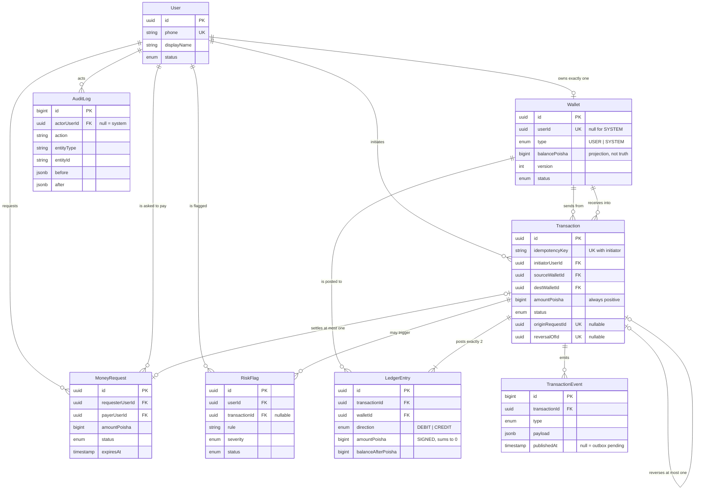

# Goti — Database Design

> Implements the data layer approved in [ARCHITECTURE.md](ARCHITECTURE.md).
> PostgreSQL 15+ · Prisma ORM · integer poisha · double-entry ledger.

| | |
|---|---|
| **Schema** | [`prisma/schema.prisma`](prisma/schema.prisma) |
| **Hardening** | [`prisma/sql/hardening.sql`](prisma/sql/hardening.sql) — CHECKs, partial indexes, triggers, grants, reconciliation views |
| **Seed** | [`prisma/seed.ts`](prisma/seed.ts) |
| **Tables** | 8 — `users`, `wallets`, `transactions`, `ledger_entries`, `transaction_events`, `money_requests`, `audit_logs`, `risk_flags` |

---

## Contents

1. [Two decisions taken before the schema](#1-two-decisions-taken-before-the-schema)
2. [Entity relationships](#2-entity-relationships)
3. [Table by table](#3-table-by-table)
4. [Concurrency: how the schema makes the engine safe](#4-concurrency-how-the-schema-makes-the-engine-safe)
5. [Indexing strategy](#5-indexing-strategy)
6. [What Prisma cannot express](#6-what-prisma-cannot-express)
7. [Migration strategy](#7-migration-strategy)
8. [Seed data strategy](#8-seed-data-strategy)
9. [What changes at Phase 2](#9-what-changes-at-phase-2)

---

## 1. Two decisions taken before the schema

The requested table list was `User, Wallet, Transaction, TransactionEvent, MoneyRequest, AuditLog, RiskFlag`. The delivered schema differs in exactly two places, both deliberate.

### 1.1 `LedgerEntry` was added

The requested list has no ledger. ARCHITECTURE.md §6 states the design's central claim:

> **The ledger is the truth.** Every other table is a command record, a cached projection of the ledger, or a queue.

Without `ledger_entries` there is no double-entry, no zero-sum invariant, no reconciliation, and no answer to "why is this balance what it is?" — `Wallet.balancePoisha` becomes an authoritative mutable number, which is precisely the design ARCHITECTURE.md §11 rejects. This is not an extra table; it is the one the rest of the schema is built to protect.

It also pays for itself immediately on the read path — see [Why history reads the ledger](#why-history-reads-the-ledger).

### 1.2 The architecture's `outbox` folded into `TransactionEvent`

ARCHITECTURE.md §6 lists a separate `outbox` table. It is gone, because `TransactionEvent` already has:

- the same **grain** — one row per thing that happened to a transaction,
- the same **write moment** — inside the money transaction, so no dual-write window,
- the same **immutability** — append-only.

The only thing the outbox added was a `published_at` marker, which is now a nullable column on `transaction_events` with a column-level UPDATE grant so the worker can mark delivery and change nothing else. One table fewer, guarantee unchanged.

### Three history tables is the right number

Three append-only tables invites the reasonable objection that they overlap. They do not — each answers a different question:

| Table | Question it answers | Grain | Contains money? |
|---|---|---|---|
| `ledger_entries` | **Where is the money?** | One posting per wallet per movement | Yes — this *is* the money |
| `transaction_events` | **What happened to this movement, in what order?** | One row per state transition | No — references it |
| `audit_logs` | **Who did what to the system, from where?** | One row per actor action | Usually not — covers login, PIN change, admin freeze |

Collapse any two and you lose something real. Fold the ledger into events and reconciliation becomes a JSON scan. Fold audit into events and you cannot record a failed login, which has no transaction to hang off.

---

## 2. Entity relationships



### The three relationship decisions worth defending

**`User ||--o| Wallet` is 1:1, enforced by a unique index on `wallets.user_id`** — not by application convention. A second wallet for a user would silently split their balance across two rows and break every history query. The database refuses it.

The relation is *optional on both sides* for one reason: SYSTEM wallets have no owner. `wallets_ownership_matches_type` in `hardening.sql` makes the nullability precise — a `USER` wallet must have an owner, a `SYSTEM` wallet must not.

**The `MoneyRequest ↔ Transaction` link lives on ONE side.** The obvious design puts `resultingTransactionId` on `MoneyRequest` *and* `originRequestId` on `Transaction`. Two columns describing one fact can disagree, and when they do there is no way to tell which is right. The FK lives only on `Transaction.originRequestId`, `UNIQUE`, so a request can be settled at most once, and `MoneyRequest.settlement` is a pure back-reference with no column behind it.

**Nothing cascades.** Every relation is `onDelete: Restrict`. There is no scenario in this system where deleting a user should delete their financial history — the delete must fail, loudly, and the correct operation is to set `status = CLOSED`. `Restrict` turns a catastrophic accident into a foreign-key error.

---

## 3. Table by table

### `users` — identity only

**Why it exists.** Someone has to own a wallet, be authenticated, and be named on the other party's transaction history.

**Why it holds no money.** Not one financial column. That separation means a user record can be renamed, suspended, or corrected without any code path that touches it being able to touch a balance.

| Column | Why |
|---|---|
| `id` | UUIDv7 from the app's `IdGenerator` port. Time-ordered — see [Why no UUID default](#why-no-uuid-default). |
| `phone` | Login identity **and** the handle for sending money. `UNIQUE` because it must resolve to exactly one account. E.164. |
| `displayName` | Shown to the counterparty. Not unique — people share names. |
| `email` | Optional. `UNIQUE` when present; PostgreSQL allows many NULLs under a unique index, which is the behaviour we want. |
| `passwordHash` | Argon2id. 255 chars fits the encoded form with room for parameter changes. |
| `status` | `ACTIVE / SUSPENDED / CLOSED`. Distinct from `WalletStatus`: a suspended user still has a balance that must reconcile. |

**Indexes.** `id` (PK), `phone` (unique — the login lookup), `email` (unique), `createdAt` (admin listing, cold path).

---

### `wallets` — the balance projection

**Why it exists.** To answer "what is my balance?" in O(1) instead of summing a ledger that grows forever.

**Why it is not the truth.** ARCHITECTURE.md §5: `balancePoisha` is a materialised sum of this wallet's ledger entries, maintained inside the same transaction as the postings. If the two ever disagree, the ledger wins and `wallet_balance_drift` reports it.

| Column | Why |
|---|---|
| `userId` | Nullable + `UNIQUE`. Enforces 1:1 at the database level; NULL carves out SYSTEM wallets. |
| `type` | `USER / SYSTEM`. Selects which balance rule applies — SYSTEM is exempt from the non-negative CHECK. |
| `currency` | ISO 4217, `CHAR(3)`. Single-currency today; the column exists so a second currency is a data change, not a migration. |
| `balancePoisha` | `BIGINT`, integer poisha. Guarded by `CHECK (balance_poisha >= 0 OR type = 'SYSTEM')` — the fourth guard from ARCHITECTURE.md §5. |
| `status` | `ACTIVE / FROZEN / CLOSED`, checked **inside the row lock**. The reconciler freezes a wallet the moment drift is detected. |
| `version` | Incremented on every balance change. Not needed for debit correctness — the conditional update handles that — but gives an optimistic-locking handle for non-money read-modify-write paths, and a cheap concurrency counter when debugging. |

**Why `SYSTEM` wallets exist.** Every taka in Goti is issued from a genesis wallet, which is debited for the full amount. Its balance is the negative of all money in circulation, so the system-wide ledger sum stays exactly `0`. Without it, seeding 50 users with 100,000 BDT each would create 5,000,000 BDT from nothing and `ledger_conservation_check` would be non-zero before anyone had done anything.

**Indexes.** `id` (PK), `userId` (unique). **No index on `status`** — 99.9% of rows are `ACTIVE`, so a full index is dead weight on the hot write path. `hardening.sql` creates a *partial* index `WHERE status <> 'ACTIVE'` instead, which stays kilobytes at 10M wallets. **No index on `balancePoisha`** — nothing queries by balance range.

---

### `transactions` — the money movement command record

**Why it exists.** ARCHITECTURE.md §11: in a CRUD design "transfer" is not a thing in the codebase — it is two `UPDATE` statements. Here it is a first-class row with an ID, an idempotency key, a state machine and an audit trail.

**Why it is not the money.** It records intent and outcome. The money is in `ledger_entries`.

| Column | Why |
|---|---|
| `idempotencyKey` | ARCHITECTURE.md §5 Stage 1. `UNIQUE (initiator_user_id, idempotency_key)` is what turns a retried request into a no-op instead of a second payment. Enforced by the database, never by a cache that can race with itself. |
| `initiatorUserId` | Who asked. For a settled request this is the **payer**, not the requester — idempotency must be scoped to whoever's money moves. |
| `type` | `P2P_TRANSFER / REQUEST_SETTLEMENT / GENESIS_ISSUANCE / REVERSAL`. All four post through the same engine; the type lets reporting distinguish them without inspecting relations. |
| `sourceWalletId` / `destWalletId` | Direction is carried here, which is why `amountPoisha` is unsigned. `CHECK (source <> dest)` blocks self-transfer structurally. |
| `amountPoisha` | `CHECK (> 0)`. |
| `status` | `PENDING → COMPLETED / FAILED → REVERSED`. A trigger rejects illegal transitions and any change to a terminal state. |
| `note` | 140 chars, shown to both parties. |
| `failureReason` | A stable machine code (`INSUFFICIENT_FUNDS`, `WALLET_NOT_ACTIVE`, `REAPED`), not a display string, so support tooling can aggregate. `CHECK` restricts it to `FAILED` rows. |
| `originRequestId` | `UNIQUE`, nullable. One request settles at most once. |
| `reversalOfId` | `UNIQUE`, nullable, self-referencing. One reversal per transaction. A reversal is a **new pair of compensating postings** — the original is never mutated. |
| `completedAt` | `CHECK (status <> 'COMPLETED' OR completed_at IS NOT NULL)`. |

**Never deleted.** A `BEFORE DELETE` trigger rejects the operation regardless of who is asking, and `goti_app` holds no DELETE grant. The trigger also freezes `amountPoisha`, both wallet IDs and the idempotency key against any UPDATE — the financial facts of a movement are fixed at creation.

**Indexes.** `(initiatorUserId, idempotencyKey)` unique — the C3 guarantee. `(sourceWalletId, createdAt DESC)` and `(destWalletId, createdAt DESC)` for support lookups. `(createdAt)` for reporting and as the future partition key. Partial `WHERE status = 'PENDING'` for the reaper.

#### Why history reads the ledger

The obvious user-facing history query is:

```sql
SELECT * FROM transactions
WHERE source_wallet_id = $1 OR dest_wallet_id = $1
ORDER BY created_at DESC LIMIT 20;
```

That `OR` across two columns cannot use one index. PostgreSQL resolves it with a `BitmapOr` over two indexes and then **sorts the union** — which at 10M users and millions of rows per popular wallet is a sort of thousands of rows to return twenty.

`ledger_entries` has **one wallet per row**, so the same question becomes:

```sql
SELECT * FROM ledger_entries
WHERE wallet_id = $1
ORDER BY created_at DESC, id DESC LIMIT 20;
```

One index, no `OR`, no sort — the index is already in the requested order, so it is a bounded index scan of exactly twenty rows. Join to `transactions` for the counterparty and note.

This is the double-entry ledger paying for itself twice: once for auditability, and once for the read path. It is also why `@@index([walletId, createdAt(sort: Desc), id])` includes `id` — the tiebreaker that makes keyset pagination stable when two entries share a timestamp.

---

### `ledger_entries` — double-entry postings, the financial source of truth

**Why it exists.** Every completed movement writes exactly two rows summing to zero. That zero is the system's health check (ARCHITECTURE.md §5).

| Column | Why |
|---|---|
| `transactionId` | Which movement produced this posting. |
| `walletId` | **One wallet per row** — the property that makes the history index clean. |
| `direction` | `DEBIT / CREDIT`. Redundant with the sign of `amountPoisha`, deliberately: it makes queries readable and the composite unique key meaningful. `CHECK` forces the two to agree, so the redundancy can never become a disagreement. |
| `amountPoisha` | **SIGNED.** Negative for DEBIT, positive for CREDIT, so `SUM()` over any consistent set is exactly `0`. |
| `balanceAfterPoisha` | The wallet's balance right after this posting, captured while the row lock is still held. Costs 8 bytes; buys statement rendering and point-in-time debugging without replaying the ledger. |

**Immutable.** A `BEFORE UPDATE OR DELETE` trigger raises unconditionally, and `goti_app` holds only `SELECT, INSERT`. The error message names the correct alternative: post a compensating `REVERSAL`, never edit history.

**Indexes.**

| Index | Serves |
|---|---|
| `(transactionId, walletId, direction)` UNIQUE | Structural guard against double-posting a leg. A retry that somehow slipped past idempotency still cannot duplicate money. |
| `(walletId, createdAt DESC, id)` | The transaction-history read path. Also covers the reconciler's `SUM(amount) GROUP BY wallet_id`. |
| `(transactionId)` | Fetch both legs of a movement — reconciliation and support. |

---

### `transaction_events` — lifecycle log and transactional outbox

**Why it exists.** Two jobs, one table (see [§1.2](#12-the-architectures-outbox-folded-into-transactionevent)): the append-only record of every state transition, and the outbox written *inside* the money transaction so an event exists if and only if the transfer committed.

| Column | Why |
|---|---|
| `id` | `BIGSERIAL`, **not** UUID. This table is a queue: the worker needs cheap monotonic ordering and the smallest possible index. Event rows are never sharded by wallet, so the UUIDv7 argument does not apply. |
| `payload` | `JSONB` snapshot of what a consumer needs without re-reading the transaction. Consumers evolve without a migration. Never back-filled. |
| `publishedAt` | NULL until delivered. The **only** column `goti_app` may UPDATE, via a column-level grant. |

**Claim rows with `FOR UPDATE SKIP LOCKED`, never a high-water cursor.** `BIGSERIAL` values are allocated before commit, so a lower id can become visible *after* a higher one. A worker tracking `WHERE id > lastSeen` will silently skip rows — a lost notification, and in a payment system a lost notification is a support ticket. Claim by `published_at IS NULL` instead:

```sql
SELECT * FROM transaction_events
WHERE published_at IS NULL
ORDER BY id
LIMIT 100
FOR UPDATE SKIP LOCKED;
```

**Indexes.** `(transactionId, occurredAt)` for one transaction's timeline. Partial `(id) WHERE published_at IS NULL` — **the most important index in the schema**: the table grows to billions, unpublished rows number in the hundreds, and this index stays a few kilobytes forever.

---

### `money_requests` — a claim, not money

**Why it exists.** ARCHITECTURE.md §5: a money request never touches a balance. Only acceptance by the payer constructs a `Transaction`, which goes through the same seven engine stages as a direct send. Keeping the request lifecycle out of the ledger is what stops "pending" from contaminating what a balance means.

| Column | Why |
|---|---|
| `idempotencyKey` | Requests are idempotent too — a retried "ask Rahim for 500" must not put two claims in his inbox. |
| `requesterUserId` / `payerUserId` | Who is owed, who is asked. `CHECK (requester <> payer)`. |
| `status` | `REQUESTED → ACCEPTED / DECLINED / CANCELLED / EXPIRED`. |
| `expiresAt` | A claim that never expires accumulates forever. `CHECK (expires_at > created_at)`. |
| `resolvedAt` | `CHECK` ties it to status: NULL while `REQUESTED`, set in every terminal state. |
| `notifiedAt` | Notification bookkeeping — deliberately **not** the outbox. A money request moves no money, so an undelivered notification is a UX incident rather than a financial one, and does not justify a second queue with stronger guarantees than it needs. |

**Indexes.** `(requesterUserId, idempotencyKey)` unique. `(payerUserId, status, createdAt DESC)` — the payer's inbox, the main read path. `(requesterUserId, createdAt DESC)` — "requests I sent". Partial `WHERE status = 'REQUESTED'` on `expiresAt` so the expiry sweep never scans settled rows.

---

### `audit_logs` — who did what, from where

**Why it exists.** The actor axis. Covers actions that move no money at all — login, failed login, PIN change, wallet freeze, admin override — which is exactly why it cannot fold into `transaction_events`.

| Column | Why |
|---|---|
| `actorUserId` + `actorType` | NULL actor means the platform itself. `actorType` disambiguates rather than leaving a bare NULL to interpret. |
| `action` | Dotted verb — `wallet.frozen`, `auth.login_failed`. `VarChar`, **not** an enum: the audit vocabulary grows constantly and an enum costs a migration per value. |
| `entityType` + `entityId` | Polymorphic target. `VarChar` because not every auditable entity is UUID-keyed. **No FK by design** — audit rows must survive their subject being archived. |
| `before` / `after` | `JSONB` state delta. |
| `ipAddress` | PostgreSQL `INET` — validates the value and supports subnet containment queries during account-takeover investigation. |
| `correlationId` | Ties the row to the HTTP request, the log lines, and the transaction events from the same request. |

**Enum vs VarChar, stated as a rule:** *enums for closed sets that form state machines; VarChar for open vocabularies.* `TransactionStatus` will not gain a value this year. `AuditLog.action` gains one most weeks.

**Indexes.** `(actorUserId, occurredAt DESC)` — "everything this user did". `(entityType, entityId, occurredAt DESC)` — "everything that happened to this object". Immutable via trigger.

---

### `risk_flags` — asynchronous detection

**Why it exists.** Fraud and abuse signals need a home, a severity, and a human review trail.

**Why it is not in the money path.** ARCHITECTURE.md forbids network calls and slow work inside the transaction boundary. A risk engine that can block a transfer is a risk engine that can take the platform down. `RiskFlag` is fed by the `transaction_events` outbox, **after** commit.

**The distinction that matters:** hard limits that *must* block — per-transfer cap, daily velocity ceiling — are **domain policy** evaluated inside the use case against the same database, cheaply, before any lock. `RiskFlag` is for post-hoc pattern detection and human review. Conflating the two is how the write path grows from 5 ms to 500 ms.

| Column | Why |
|---|---|
| `userId` | The subject. Always present — a flag is always about someone. |
| `transactionId` | Nullable: account-level patterns (credential stuffing, device churn) have no transaction. |
| `rule` | Which detector fired. `VarChar` for the same reason as `AuditLog.action`. |
| `severity` / `status` | Triage and workflow. `CHECK` ties review fields to status — a `CONFIRMED` flag must name its reviewer. |
| `details` | `JSONB` evidence: thresholds, observed values, window examined. Each rule stores the shape that makes its own decision reviewable. |

**Indexes.** `(userId, status, createdAt DESC)` — open flags for a user. `(transactionId)` — why was this flagged. Partial `WHERE status IN ('OPEN','UNDER_REVIEW')` ordered by severity — the analyst queue is tiny, the table is not.

---

## 4. Concurrency: how the schema makes the engine safe

The schema exists to make ARCHITECTURE.md §5 implementable. Here is each stage against Prisma.

### Stage 3 — the conditional atomic debit *is* expressible in Prisma

This is the single most important query in the system, and it needs no raw SQL:

```ts
const { count } = await tx.wallet.updateMany({
  where: {
    id: sourceWalletId,
    status: 'ACTIVE',
    balancePoisha: { gte: amountPoisha },   // the guard
  },
  data: {
    balancePoisha: { decrement: amountPoisha },  // the mutation
    version: { increment: 1 },
  },
});

if (count === 0) throw new InsufficientFundsError();
```

`updateMany` compiles to a single `UPDATE ... WHERE ...` statement. The guard and the mutation are one atomic operation evaluated by the database; `count === 0` means insufficient funds (or a non-active wallet). **At no point does application code hold a balance in a variable**, which is exactly why constraint C1 cannot occur.

Note `updateMany`, not `update` — `update` targets a unique row and throws when the `where` does not match, which would conflate "insufficient funds" with "wallet missing".

### Read Committed is the correct isolation level

```ts
await prisma.$transaction(
  async (tx) => { /* stages 1–7 */ },
  { isolationLevel: Prisma.TransactionIsolationLevel.ReadCommitted,
    timeout: 5_000, maxWait: 2_000 },
);
```

In Read Committed, when an `UPDATE` finds a row that a concurrent transaction has modified, PostgreSQL blocks, then **re-evaluates the `WHERE` clause against the newly committed row version**. The `balance >= amount` guard is therefore never evaluated against stale data — the correctness of Stage 3 does not depend on a stricter level.

`Serializable` would add serialisation failures and a retry loop for no additional guarantee here. Choosing the weakest sufficient level is what keeps the hot path short.

### Stage 2 — lock ordering needs raw SQL

Prisma has no `SELECT ... FOR UPDATE`. This is one of the few places raw SQL is mandatory:

```ts
// ARCHITECTURE.md §5 Figure 4: sort by id so no lock cycle can form.
const [first, second] = [sourceWalletId, destWalletId].sort();

await tx.$executeRaw`
  SELECT id FROM wallets
  WHERE id IN (${first}::uuid, ${second}::uuid)
  ORDER BY id
  FOR UPDATE
`;
```

`ORDER BY id` inside the statement is not decoration — it is what guarantees both wallets are locked in the same total order by every transaction in the system.

### Stage 7 — the outbox row is written inside the same `$transaction`

`tx.transactionEvent.create(...)` before the callback returns. Prisma's interactive transaction is one database transaction, so the event and the postings commit together or not at all. No dual write.

### Where each constraint is enforced

| Constraint | Enforced by | Where |
|---|---|---|
| C1 lost update | Conditional `updateMany` + row lock + `CHECK` | Engine + `hardening.sql` |
| C2 deadlock | `ORDER BY id ... FOR UPDATE` | Raw SQL, Stage 2 |
| C3 retries | `UNIQUE (initiatorUserId, idempotencyKey)` | `schema.prisma` |
| C4 partial writes | One `$transaction` around stages 1–7 | Engine |
| C5 auditability | `ledger_entries` + immutability triggers | `hardening.sql` |
| C6 read pressure | `(walletId, createdAt DESC, id)` on the ledger | `schema.prisma` |

---

## 5. Indexing strategy

**The governing principle: every index is a tax on every write.** On a money system the write path is the expensive path, so an index earns its place by serving a query that actually runs, or it does not exist.

| Table | Indexes | Rationale |
|---|---|---|
| `users` | 4 | PK, `phone` (login + send-to lookup), `email`, `createdAt` (cold admin path) |
| `wallets` | 2 + 1 partial | PK, `userId` unique. Partial on non-ACTIVE — no full `status` index. |
| `transactions` | 4 + 1 partial | Idempotency unique, two directional lookups, `createdAt`. Partial on `PENDING` for the reaper. |
| `ledger_entries` | 3 | Composite unique guard, the history index, transaction lookup. **Nothing else** — this is the highest-volume insert path in the system. |
| `transaction_events` | 1 + 1 partial | Timeline. Partial on unpublished — the outbox claim. |
| `money_requests` | 3 + 2 partial | Unique, payer inbox, sender list. Partials for the expiry sweep and notification backlog. |
| `audit_logs` | 2 | Actor timeline, entity timeline. |
| `risk_flags` | 2 + 1 partial | User flags, transaction lookup. Partial for the review queue. |

### Three rules applied throughout

**Partial indexes wherever the query targets a minority state.** Six of them. Each covers a background job — outbox delivery, the reaper, the expiry sweep, the review queue — where matching rows number in the hundreds while the table grows without bound. A full index on the same column would carry millions of dead entries and slow every insert.

**Composite column order is `(equality, range, tiebreaker)`.** `(walletId, createdAt DESC, id)` — filter on wallet, scan the range in already-sorted order, break ties stably. Reversing the first two makes the index useless for this query.

**Sort direction is declared, not assumed.** `createdAt(sort: Desc)` matches how the data is actually read — newest first, always. A default-ascending index forces either a backward scan or a sort.

---

## 6. What Prisma cannot express

Prisma is the right tool here — type-safe queries, honest migrations, an excellent transaction API — but it does not cover everything a financial schema needs. Being explicit about the gaps is what keeps them from becoming surprises.

| Requirement | Prisma | Covered by |
|---|---|---|
| `CHECK` constraints | Not supported | `hardening.sql` §1 — 16 constraints |
| Partial indexes | Not supported | `hardening.sql` §2 — 6 indexes |
| Triggers / immutability | Not supported | `hardening.sql` §3 — 4 triggers |
| Column-level grants | Not supported | `hardening.sql` §4 |
| Views | Not supported | `hardening.sql` §5 — 3 reconciliation views |
| `SELECT ... FOR UPDATE` | Not supported | `$executeRaw`, Stage 2 |
| `FOR UPDATE SKIP LOCKED` | Not supported | `$queryRaw`, outbox worker |
| Table partitioning | Not supported | Deferred to Phase 2 — [§9](#9-what-changes-at-phase-2) |
| Conditional atomic update | **Supported** | `updateMany` with a guard in `where` |
| Interactive transactions | **Supported** | `$transaction(async (tx) => …)` |

### Never run `prisma db push`

`db push` diffs the live database against `schema.prisma` alone. It has no knowledge of the CHECK constraints, partial indexes, triggers, grants or views in `hardening.sql`, so it treats them as drift and **drops them** — silently removing every guard the design depends on.

Use `prisma migrate` exclusively, on every environment including local. Add `db push` to the team's forbidden-commands list.

### Why no UUID default

Aggregate roots (`User`, `Wallet`, `Transaction`, `LedgerEntry`, `MoneyRequest`, `RiskFlag`) have `@id @db.Uuid` with **no `@default`**. The application must supply the ID through the `IdGenerator` port that ARCHITECTURE.md §3 already defines at L1.

The tempting alternative, `@default(dbgenerated("gen_random_uuid()"))`, produces UUIDv4 — uniformly random. Random keys scatter B-tree inserts across the whole index instead of appending to the right edge, which at `ledger_entries` volumes (6.4M rows/day) means constant page splits, poor cache locality and index bloat. **UUIDv7 is time-ordered**, so inserts stay local, and it remains globally unique and shard-friendly for Phase 3.

Making the column defaultless is deliberate friction: it is impossible to accidentally get a v4 because you forgot. Missing the ID is a compile error, not a performance problem discovered six months later.

`transaction_events` and `audit_logs` use `BIGSERIAL` instead — they are queues and logs, never sharded by wallet, and they benefit from the smallest, most sequential key available.

### BigInt does not serialise to JSON

`JSON.stringify(10_000_000n)` throws. Every API response and every JSONB payload carrying an amount must convert first. The seed does this explicitly (`amountPoisha.toString()`); the adapter layer needs a serialiser registered once at the boundary. This is a real papercut of the correct money type, and worth the trade.

---

## 7. Migration strategy

### Two roles

| Role | Owns | Used by |
|---|---|---|
| `goti_migrator` | Every object. DDL rights. | `prisma migrate deploy` in CI |
| `goti_app` | Nothing. Table-scoped DML only. | The running application |

`goti_app` has no `DELETE` on `transactions`, `ledger_entries` or `audit_logs`, and only a column-level `UPDATE (published_at)` on `transaction_events`. The role serving traffic cannot reshape the schema, and cannot delete money.

### The authoring workflow

Because most hardening is raw SQL, `--create-only` is the normal path, not an exception:

```bash
# 1. Edit schema.prisma
# 2. Generate the migration WITHOUT applying it
npx prisma migrate dev --create-only --name add_wallet_daily_limit

# 3. Hand-edit the generated migration.sql — add CHECKs, partial indexes,
#    triggers, grants for any new table
# 4. Apply
npx prisma migrate dev

# Production
npx prisma migrate deploy
```

### Rules

1. **Never `db push`.** See above.
2. **Never edit an applied migration.** Prisma checksums them; a change makes the history unresolvable. Always add a new migration.
3. **Every new table needs a grant.** `hardening.sql` sets no blanket `DEFAULT PRIVILEGES` on purpose — a new table is inaccessible to `goti_app` until granted deliberately. Silence is the safe default for a money system.
4. **Keep the shadow database enabled** in development. It is how Prisma detects that someone changed production by hand.

### Expand–contract, mapped to Prisma

ARCHITECTURE.md §9 requires zero-downtime, reversible migrations. Each step is its own migration and its own deploy:

| Step | Migration | Deploy |
|---|---|---|
| 1. Expand | Add column **nullable**, no default | Safe with old code running |
| 2. Dual-write | — | App writes both old and new |
| 3. Backfill | Batched `UPDATE ... WHERE id BETWEEN` | Run as a job, never one statement |
| 4. Switch reads | — | App reads new |
| 5. Stop writing old | — | App writes only new |
| 6. Contract | Drop the old column | Only after 5 is fully rolled out |

Never combine steps. Adding a `NOT NULL` column with a default on a large table rewrites it under an `ACCESS EXCLUSIVE` lock — that is an outage, not a migration.

### The `CREATE INDEX CONCURRENTLY` problem

`CONCURRENTLY` cannot run inside a transaction block, and Prisma wraps every migration in one. Options, in order of preference:

1. **On an empty database** (first deploy), drop the keyword — plain `CREATE INDEX` on zero rows is instant.
2. **On a populated table**, put the statement in its own migration directory containing nothing else, and run it outside Prisma's transaction wrapper.
3. Apply it manually during a maintenance window and record it with `prisma migrate resolve --applied`.

Getting this wrong on a live `ledger_entries` table means an `ACCESS EXCLUSIVE` lock on the highest-volume table in the system.

### The gate for money-table migrations

Any migration touching `wallets`, `transactions` or `ledger_entries` requires:

- [ ] Ran against a restored production-shaped dump, not an empty database
- [ ] `EXPLAIN` on the new plan for the history query and the debit query
- [ ] `wallet_balance_drift` empty and `ledger_conservation_check` = 0 after applying
- [ ] The 500-concurrent-transfer test from ARCHITECTURE.md §10 still passes
- [ ] A written rollback step — or an explicit note that the step is expand-only and therefore safe

---

## 8. Seed data strategy

### The rule: opening balances are issued, never assigned

The naive seed writes `balancePoisha = 10_000_000` onto each wallet. That produces a database where `wallet_balance_drift` is non-empty and `ledger_conservation_check` is non-zero on the first run — the reconciler alarms before anyone has done anything, and the team learns to ignore it. **An alarm you have trained yourself to ignore is worse than no alarm.**

So the seed does what the Transaction Engine does. It posts:

```
Genesis wallet (SYSTEM)  ──DEBIT  −100,000 BDT──→  ledger_entries
User wallet              ──CREDIT +100,000 BDT──→  ledger_entries
                                     sum = 0  ✓
```

Each issuance is a real `GENESIS_ISSUANCE` transaction with two balanced ledger entries, a balance update and a `TransactionEvent`, all inside one `$transaction`. After 50 users the genesis wallet holds −5,000,000 BDT, every user holds 100,000 BDT, and the system-wide sum is exactly zero.

The genesis wallet is `type = SYSTEM`, which is why `wallets_balance_non_negative` carries the `OR type = 'SYSTEM'` exemption — the one account in Goti that is *supposed* to be negative.

### Tiers

| Tier | Users | Contents | Use |
|---|---|---|---|
| `minimal` | 2 | Genesis wallet, 2 users + wallets, issuance | Unit and contract tests. Deterministic fixtures. |
| `dev` *(default)* | 50 | Above + money requests in every terminal state, risk flags, audit rows | Local development, demo |
| `load` | 100k+ | Skeleton only — see below | Performance testing |

```bash
npx prisma db seed                            # dev tier
SEED_TIER=minimal npx prisma db seed          # test fixtures
SEED_RESET=true npx prisma db seed            # truncate + re-seed
```

### Deterministic IDs

Fixtures use fixed UUIDs derived from an index, so `USER_IDS[0]` is the same row on every machine and every run. **Reproducibility beats realism in a seed** — a test that fails only on CI because the seed randomised is worse than no test. The fixtures are shaped like UUIDv7 (version nibble `7`) so they sort the way real data will.

Names and E.164 numbers are Bangladeshi, so a demo reads like the product rather than like `user1@test.com`.

### Idempotency and reset

Users and wallets use `upsert` on fixed IDs. Issuances check for an existing transaction ID before posting — re-running the seed never double-issues.

Reset uses `TRUNCATE`, not `DELETE`, deliberately: the append-only triggers **block row-level DELETE** on `ledger_entries`, `transactions` and `audit_logs`, which is the point of them. `TRUNCATE` does not fire row triggers, so it remains the one sanctioned way to clear a development database. It is hard-blocked when `NODE_ENV=production`.

### The seed verifies itself

Before exiting, the seed queries `ledger_conservation_check` and `wallet_balance_drift` and throws if either is wrong. If the seed can leave the database inconsistent, it will — and finding out here costs seconds instead of a confusing reconciler page later.

### Load tier

Not implemented in `seed.ts` on purpose. `createMany` round-trips through the query engine at roughly 5–10k rows/sec; 100k users plus wallets plus issuance postings is ~500k rows and tens of minutes.

Use `COPY FROM STDIN` instead — the same data in seconds. Generate TSV, stream it through the `pg` driver, then post issuances in batched SQL rather than row by row. Kept out of the Prisma seed so nobody triggers it by accident before a demo.

---

## 9. What changes at Phase 2

ARCHITECTURE.md §8 defers partitioning, read replicas and the feed projection to Phase 2. The schema is built so none of them is a rewrite.

**Partitioning is deliberately not applied now.** `ledger_entries` and `transaction_events` will partition monthly by `createdAt`, but a partitioned table requires the partition key in its primary key — `@@id([id, createdAt])` instead of `@@id([id])` — which changes every foreign key referencing it. At Phase 1 volumes this buys nothing and costs schema churn.

**What to get right now so Phase 2 is cheap:**

- Always filter by `createdAt` alongside `walletId` in history queries. Code written this way needs no change when partition pruning arrives; code written without it will scan every partition.
- Keep `ledger_entries` free of foreign keys *pointing at it*. Nothing references a ledger entry today, which is what makes the composite-PK change local.
- Treat `transaction_feed` as absent. History reads the ledger directly with the composite index, which is correct well past a million rows per wallet. The projection is an optimisation, not a dependency.

**Read replicas** need no schema change — only a second Prisma client bound to a replica URL, used exclusively for history and balance reads. The write path stays on the primary.

---

<sub>Goti · গতি — motion · Database design rev 2026-08-29 · PostgreSQL · Prisma · Implements ARCHITECTURE.md §6</sub>
