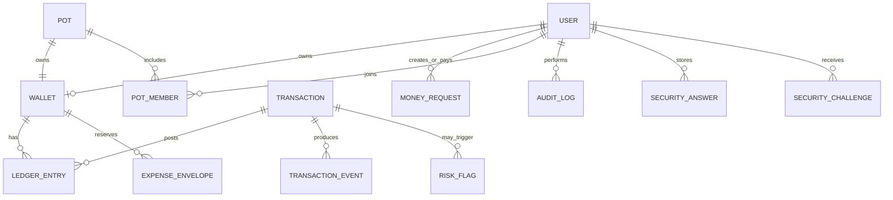

# Goti Project Explanation and Viva Guide

This document explains the complete Goti project in simple language. It is written so I can use it for a class presentation, code walkthrough, or viva.

> Important scope: Goti is a prototype digital-wallet system using fake BDT. It demonstrates safe money movement; it is not a real bank or payment provider.

## 1. The 30-second explanation

Goti is a full-stack digital wallet application. A user can register, log in, view a wallet, send or request money, inspect transaction history, reserve money for expenses, collect money in group pots, freeze a wallet, and view explainable risk alerts.

The most important backend rule is that a transfer must never create, lose, or duplicate money. I solved this with:

- integer poisha instead of floating-point money;
- one transaction engine for every money movement;
- PostgreSQL database transactions and row locking;
- an immutable double-entry ledger;
- idempotency keys to stop duplicate payments;
- Redis only for speed, never as the source of financial truth;
- validation, JWT authentication, audit logs, and rule-based risk checks.

The main request flow is:

```text
React page
   -> HTTP Controller
   -> Application Use Case / Service
   -> Repository Port
   -> Prisma Repository
   -> PostgreSQL
```

For a money movement, the use case calls the transaction engine before the repositories.

## 2. What problem does Goti solve?

A basic CRUD application can change a number called `balance`. A financial application needs stronger guarantees. It must answer:

- What if two transfers spend the same balance at the same time?
- What if the client retries after a network timeout?
- What if the server crashes after debiting the sender?
- What if Redis is unavailable?
- How can we prove where every unit of money went?
- How can we explain why a transfer was considered risky?

Goti treats these as the main engineering problems. The screens and REST endpoints sit on top of that safety model.

## 3. Main features

| Area | What the user can do | Main backend idea |
|---|---|---|
| Authentication | Register and log in | Argon2id password hashing and JWT |
| Profile | View the authenticated account | Identity comes from the verified token |
| Wallet | View wallet and balance | PostgreSQL is authoritative; Redis caches short-lived display data |
| Send money | Transfer to another user | Atomic transaction engine and idempotency |
| Money requests | Create, accept, decline, and list requests | A request is only a claim; accepting it creates a real transfer |
| Transaction history | Page, filter, sort, and inspect a transaction | Reads the indexed ledger and event timeline |
| Audit | Track logins, transfers, failures, and security actions | Append-only forensic history |
| Risk | Explain suspicious behavior | Deterministic weighted rules |
| Emergency freeze | Stop outgoing money immediately | Wallet status is checked inside the atomic debit |
| Expense envelopes | Reserve spending capacity | `spendable = balance - reserved`; no money is moved |
| Group pots | Collect and settle group money | Each pot owns a real wallet and uses the same transaction engine |
| Monitoring | Check service readiness and demonstrate degradation | Redis failure affects speed, not correctness |

## 4. Technology and tools used, in very simple language

| Tool | Simple meaning | What Goti uses it for | Why this helps |
|---|---|---|---|
| Node.js | The program that runs JavaScript on a server | Runs the backend | The frontend and backend can share TypeScript knowledge |
| TypeScript | JavaScript with type checking | Describes request, response, service, and repository shapes | It catches mistakes such as a missing field before the app runs |
| NestJS 10 | A backend framework | Controllers, modules, dependency injection, guards, filters | It gives every kind of code a clear home |
| PostgreSQL | The permanent record book | Users, wallets, ledger, transfers, audit, requests, pots | It can safely commit several related writes together |
| Prisma 6 | A typed translator between TypeScript and PostgreSQL | Queries, schema definition, and migrations | Most database calls are checked by TypeScript |
| Raw SQL | Direct instructions to PostgreSQL | Locks, atomic debit, hard constraints, reconciliation | Some financial guarantees need exact database behavior |
| Redis 7 | A very fast temporary notebook | Short balance cache, first duplicate check, rate limits | It removes avoidable work from PostgreSQL, but may safely be lost |
| ioredis | The Node.js Redis driver | Sends commands to Redis | It supports reconnects, Lua, TTL, and connection handling |
| Argon2id | A one-way password scrambler | Hashes passwords and security answers | A database leak does not reveal the original secrets |
| JWT | A signed digital identity card | Authenticates protected requests | Any API instance can verify the caller without a server session |
| class-validator | An input checker | Checks phone, UUID, amount, page size, and required fields | Bad data is rejected before reaching business logic |
| class-transformer | A safe input converter | Converts query/body values to expected DTO types | Controllers receive predictable values |
| React 18 | A browser UI library | Builds pages from reusable components | UI pieces are easier to reuse and maintain |
| React Router | A page traffic controller | Chooses login, send, history, pot, and other pages | The single-page app can have normal URLs |
| Tailwind CSS | A styling toolbox | Layout, colors, spacing, responsive design | Styling stays consistent without a large custom CSS file |
| Vite | A frontend builder and development server | Runs and bundles the React app | Fast feedback during development and a small production bundle |
| Jest / ts-jest | An automatic question-and-answer checker | Runs unit tests against TypeScript code | Important rules can be checked repeatedly |
| ESLint | A code reviewer for common patterns | Finds style and quality problems | Reduces easy-to-miss mistakes |
| Prisma migrations | Version history for the database | Applies schema changes in order | Every environment can reach the same schema safely |
| Docker | A standard box for a service | Runs local Redis or PostgreSQL consistently | Developers do not need different manual setups |

Simple analogy:

- React is the customer counter.
- A controller is the receptionist.
- A use case is the manager who knows the process.
- A repository is the clerk who reads and writes records.
- PostgreSQL is the permanent locked record room.
- Redis is the small fast note on the receptionist's desk.
- The transaction engine is the cashier who is the only person allowed to move money.

## 5. Codebase structure

```text
goti/
|-- src/
|   |-- domain/                 Pure money rules and domain errors
|   |-- application/
|   |   |-- use-cases/          One application operation per class
|   |   |-- transaction-engine/ The only normal balance-changing path
|   |   |-- services/           Audit, risk, security-question services
|   |   |-- ports/              Interfaces required by the application
|   |   `-- cache/              Cache-key definitions
|   |-- adapters/http/
|   |   |-- controllers/        REST endpoints; intentionally thin
|   |   |-- dto/                Request validation
|   |   `-- http.plumbing.ts    JWT guard, exception filter, interceptors
|   |-- infrastructure/
|   |   |-- persistence/        Prisma repository implementations
|   |   |-- prisma/             Prisma connection lifecycle
|   |   |-- redis/              Cache, idempotency, rate-limit adapters
|   |   |-- security/           Argon2 and JWT implementations
|   |   `-- health/             Liveness and readiness endpoints
|   |-- config/                 Validated Redis configuration
|   |-- app.module.ts           Composition root
|   `-- main.ts                 Server bootstrap, validation, CORS, shutdown
|-- prisma/
|   |-- schema.prisma           Database model
|   |-- migrations/             Versioned SQL changes
|   |-- sql/                    Extra hardening and reconciliation SQL
|   `-- seed.ts                 Demonstration users and opening balances
|-- web/
|   |-- src/api/                One frontend HTTP client and wire types
|   |-- src/pages/              Application pages
|   |-- src/components/         Reusable UI
|   |-- src/hooks/              Shared async state logic
|   `-- src/auth/               Frontend session context
|-- ARCHITECTURE.md             Detailed architectural decisions
|-- DATABASE.md                 Schema and indexing decisions
|-- ENGINE.md                   Transaction-engine details
|-- REDIS.md                    Redis policy and degradation behavior
`-- README.md                   Setup and quick project overview
```

## 6. Architecture in simple terms

### Controller

A controller deals only with HTTP. It receives a DTO, gets the authenticated user, calls a use case, and returns the result.

Example: `WalletController.sendMoney()` does not calculate a balance or run SQL. It converts the validated amount to `BigInt` and calls `SendMoneyUseCase`.

Short viva answer: **“Controllers translate HTTP into an application command; they do not own business rules.”**

### Use case / service

A use case coordinates one business action. It checks authorization and business conditions, calls ports, starts the transaction engine when necessary, and returns a stable result.

Examples include `RegisterUserUseCase`, `SendMoneyUseCase`, `CreateMoneyRequestUseCase`, and `ListTransactionsUseCase`.

### Port

A port is a TypeScript interface owned by the application layer. It says what the application needs, such as “find a wallet” or “append a ledger entry,” without knowing Prisma or Redis.

### Repository adapter

A repository implements a port using Prisma and PostgreSQL. SQL and ORM details stay here. This also makes use cases easy to unit-test with fake repositories.

### Domain

The domain contains pure rules such as exact money arithmetic and named errors. It has no NestJS, Prisma, Redis, or HTTP imports.

### Dependency injection

NestJS creates the objects and connects interfaces to implementations. `AppModule` is the composition root. Changing a Redis or Prisma adapter does not require rewriting the use cases.

## 7. Why there is no business logic in controllers

Thin controllers provide three benefits:

- The same use case can later be called from REST, a queue worker, or a CLI.
- Rules are tested without creating an HTTP server.
- Database code cannot become duplicated across endpoints.

For example, insufficient-balance logic belongs in the transaction path, not in the send-money controller. A controller-side balance check could become stale immediately when another request spends at the same time.

## 8. How money is represented

Goti stores money as an integer number of poisha:

```text
1 BDT = 100 poisha
10.50 BDT = 1050 poisha
```

The backend uses JavaScript `BigInt` and PostgreSQL `BIGINT`. It never uses a floating-point value for financial arithmetic because values such as `0.1` cannot always be represented exactly in binary floating point.

JSON cannot directly serialize `BigInt`, so `BigIntSerializerInterceptor` converts it to a string in API responses. The frontend keeps money strings as strings and renders the backend's formatted value instead of recalculating the balance.

Short viva answer: **“Money is a count of the smallest unit, so addition and comparison are exact.”**

## 9. Database design

### Main models

| Model / table | Purpose |
|---|---|
| `User` / `users` | Identity, phone, email, password hash, account status |
| `Wallet` / `wallets` | Current balance projection, reserved amount, currency, wallet status |
| `Transaction` / `transactions` | Transfer command, status, amount, participants, idempotency key |
| `LedgerEntry` / `ledger_entries` | Immutable debit and credit postings; financial truth |
| `TransactionEvent` / `transaction_events` | Transfer lifecycle timeline and transactional outbox |
| `MoneyRequest` / `money_requests` | Requester, payer, amount, expiry, decision, settlement link |
| `AuditLog` / `audit_logs` | Actor, action, target, IP, user agent, correlation ID, before/after |
| `RiskFlag` / `risk_flags` | Rule, severity, evidence, review status |
| `WalletSecurityEvent` | Append-only freeze and unfreeze history |
| `ExpenseEnvelope` | Named reserved spending capacity |
| `Pot` | Group goal linked one-to-one with a pot wallet |
| `PotMember` | Membership and contribution summary |
| `SecurityAnswer` | Argon2id hash of a user's answer |
| `SecurityChallenge` | Short-lived challenge bound to a protected action |

### Simplified relationship view



### Source of truth versus projections

The ledger is the financial source of truth. `wallets.balance_poisha` is a fast current projection updated in the same database transaction.

This gives both:

- fast `GET /wallet/balance` reads; and
- a permanent explanation of how the balance was formed.

### Double-entry ledger

Every successful transfer posts two signed entries:

```text
Sender ledger entry:   -5000 poisha (DEBIT)
Receiver ledger entry: +5000 poisha (CREDIT)
---------------------------------------------
Sum:                       0 poisha
```

If the sum is not zero, money was created or lost. SQL constraints, immutability triggers, and reconciliation views make this detectable.

### Important database protections

- Unique phone and email stop duplicate accounts.
- Unique `(initiator_user_id, idempotency_key)` guarantees one financial result per intent.
- Unique ledger constraints stop duplicate debit/credit postings.
- Check constraints reject non-positive transfer amounts and invalid states.
- Foreign keys keep related records valid.
- Append-only triggers protect ledger, events, and audit history from mutation.
- Composite indexes support wallet history, pending requests, risk review, and audit queries.
- Reconciliation views check ledger conservation, wallet/ledger drift, and reserved/envelope drift.

### Migrations and seeding

Prisma migrations version the database changes. The repository currently includes the initial schema, financial hardening, safety features, pot-wallet ownership, pot invite codes, and security-question migration.

The seed creates demonstration users. A new user's 100,000 BDT opening balance is not assigned from nowhere: it is issued from a fixed genesis system wallet with a balanced debit and credit.

## 10. The transaction engine

Every real money movement uses `TransactionProcessor`. Normal use cases are not allowed to update wallet balances directly.

```text
Controller
   -> SendMoneyUseCase / request settlement / pot contribution
      -> TransactionProcessor
         -> validation
         -> risk assessment
         -> database transaction
            -> lock wallets in a stable order
            -> atomic conditional debit
            -> credit receiver
            -> append two ledger entries
            -> append timeline and audit records
            -> mark transaction COMPLETED
```

### Transfer algorithm, step by step

1. Reserve the idempotency key in Redis as a fast duplicate check.
2. Resolve the sender and receiver from PostgreSQL.
3. Validate positive amount, BDT currency, active participants, and no self-transfer.
4. Gather risk signals and evaluate explainable rules.
5. Open one PostgreSQL transaction.
6. Create or find the transaction using the database idempotency constraint.
7. Lock the involved wallet rows in sorted ID order.
8. Re-check important conditions under the lock.
9. Debit with one conditional SQL update.
10. Credit the receiver.
11. Write one debit and one credit ledger entry.
12. Write transaction events and financial audit data in the same commit.
13. Commit and invalidate affected Redis cache keys.
14. Return `transactionId`, `status`, and `timestamp`.

The core debit is equivalent to:

```sql
UPDATE wallets
SET balance_poisha = balance_poisha - :amount
WHERE id = :sender_wallet
  AND status = 'ACTIVE'
  AND balance_poisha - reserved_poisha >= :amount;
```

The check and update happen in one statement. If zero rows change, the debit is refused. There is no separate “read balance, calculate in JavaScript, write balance” race window.

## 11. How important transfer problems were solved

| Problem | Solution |
|---|---|
| Two requests spend the same money | Row locks plus an atomic conditional debit |
| Sender debited but receiver not credited | Both updates and ledger posts are in one PostgreSQL transaction |
| Client retries after timeout | Required idempotency key and database unique constraint |
| Same two wallets transfer in opposite directions | Wallet locks are acquired in sorted ID order to reduce deadlocks |
| Insufficient money | Conditional debit changes zero rows; a durable FAILED result is returned |
| Invalid receiver | Validation rejects before any balance change |
| Frozen sender | Status is checked before, under the lock, and inside the debit SQL |
| Redis is down | The request continues to PostgreSQL; correctness is unchanged |
| Temporary lock or database contention | Retry up to three times with exponential backoff and jitter |
| Business rejection | Do not retry; “no” is a stable decision |
| App crashes after commit before replying | The same idempotency key replays the stored result |
| Need to investigate a transfer | Transaction row, two ledger entries, events, audit record, and correlation ID |

Short viva answer: **“The database transaction makes the movement all-or-nothing, and idempotency makes retries one logical operation.”**

## 12. Authentication and security decisions

### Registration

`POST /auth/register` validates the Bangladeshi E.164 phone number, display name, password length, optional email, and exactly three different security answers. The password and answers are hashed before storage. User creation, wallet creation, security-answer creation, and the balanced opening issue happen in one database transaction.

### Login

`POST /auth/login` verifies the Argon2id hash and returns a short-lived bearer JWT. Protected calls send:

```http
Authorization: Bearer <access-token>
```

### Why Argon2id?

Passwords are not encrypted because encryption is reversible. They are hashed with a slow, memory-hard algorithm. The stored Argon2id value contains its salt and cost parameters. Login can transparently rehash an old password when the configured policy becomes stronger.

### Secure login errors

An unknown phone and a wrong password both return `INVALID_CREDENTIALS`. Otherwise, an attacker could discover registered phone numbers.

The system also verifies a dummy hash when the phone does not exist. This makes missing-user and wrong-password requests take a more similar amount of time and reduces timing-based account enumeration.

### JWT decisions

- The secret is mandatory and must be at least 32 bytes.
- Algorithm, issuer, audience, and expiry are checked.
- The token contains only minimum identity claims: user ID and phone.
- `JwtAuthGuard` is global, so routes are protected by default.
- Only registration, login, liveness, and readiness are explicitly public.
- Resource ownership is still checked in use cases; a valid token is not permission to read another user's data.

### Validation and error handling

The global `ValidationPipe` transforms input, rejects unknown properties, and validates DTO fields. Shape validation belongs in DTOs; live business rules belong in services or the transaction engine.

`DomainExceptionFilter` converts named domain failures into consistent HTTP error envelopes without exposing SQL, password hashes, stack traces, or internal driver errors.

Example error shape:

```json
{
  "statusCode": 400,
  "code": "INSUFFICIENT_FUNDS",
  "message": "The wallet does not have enough spendable balance.",
  "retryable": false,
  "correlationId": "...",
  "timestamp": "..."
}
```

### Rate limiting and CORS

Authentication and money actions use rate limits. Redis provides the shared limit; a per-process fallback operates if Redis fails. Emergency freeze is deliberately not throttled because a compromised user must always be able to stop outgoing money.

CORS uses an explicit origin allow-list. The bearer token is in the `Authorization` header rather than a credentialed cross-origin cookie.

## 13. Wallet and Redis cache

`GET /wallet` returns a fresh wallet view from PostgreSQL. `GET /wallet/balance` can use a five-second Redis cache because this value is for display.

Redis never decides whether a payment is allowed. The transaction engine always asks PostgreSQL and performs the atomic debit there.

After a successful transfer, the service deletes the affected balance and recent-history cache keys. It deletes rather than writing a guessed new cache value, because concurrent commits could otherwise write stale values out of order.

If Redis fails:

- balance reads fall back to PostgreSQL;
- idempotency still has the database unique constraint;
- rate limiting uses a local fallback;
- a circuit breaker temporarily stops repeatedly calling an unhealthy Redis;
- transfers remain financially correct.

Short viva answer: **“Redis improves latency; PostgreSQL guarantees correctness.”**

## 14. Money request workflow

A money request is not a transfer. Creating one does not reserve, debit, or credit any balance.

```text
REQUESTED
  |-- payer accepts  -> settlement through Transaction Engine -> ACCEPTED
  |-- payer rejects  -> DECLINED
  |-- time expires   -> EXPIRED
  `-- requester cancels internally -> CANCELLED
```

Important decisions:

- The requester chooses exactly one payer by user ID or phone.
- The request has its own idempotency key and a seven-day expiry.
- Only the payer can accept or decline it.
- Accepting calls the same transaction engine with the payer as sender.
- A compare-and-set database update prevents two simultaneous accepts.
- The settlement transaction is linked to the request.
- If the transfer fails for insufficient money, the request can remain available rather than falsely becoming paid.
- Pending-list queries exclude expired requests.

This separation is important: a request expresses “you owe me”; the ledger changes only when the payer accepts and the transfer commits.

## 15. Transaction history

### List endpoint

`GET /transactions` supports:

- page and page size, with a maximum page size of 100;
- direction: `SENT` or `RECEIVED`;
- status filtering;
- ISO date range;
- sort by newest, oldest, largest, or smallest.

History is based on a user's ledger entries. This avoids a large `sourceWallet OR destinationWallet` query and uses the index on `(walletId, createdAt DESC, id)`.

### Detail endpoint

`GET /transactions/:id` returns:

- transaction type, status, amount, note, and timestamps;
- sender and receiver details allowed for the viewer;
- failure reason when applicable;
- debit and credit ledger entries;
- ordered lifecycle timeline from `transaction_events`.

The repository scopes the lookup to the caller's wallet. An unauthorized transaction looks the same as a missing transaction, so IDs cannot be used to probe another user's activity.

## 16. Audit and observability

Audit logs answer “who did what, to which object, when, and from where?” They include:

- successful and failed login;
- registration and password rehash;
- transfer attempts, completion, duplicate replay, and failure;
- money-request actions;
- risk flags and rate limits;
- wallet freeze/unfreeze;
- envelope and pot actions;
- actor ID, IP address, user agent, before/after JSON, and correlation ID.

Financial audit records are written inside the money transaction where atomicity matters. General audit logging is best effort so an optional logging failure does not necessarily take down the whole API.

Three append-only histories have different purposes:

| History | Question answered |
|---|---|
| Ledger entry | Where did the money go? |
| Transaction event | What stage did this transfer reach? |
| Audit log | Who performed the action and from where? |

The correlation interceptor accepts a valid UUID correlation ID or creates one. The same ID is returned in the response and recorded with events and audit information, making a support investigation much easier.

## 17. Transaction events and outbox

`transaction_events` is both a user-visible timeline and a transactional outbox.

An event is inserted in the same database transaction as the money change. A later worker can publish pending events to notifications or analytics. This avoids the unsafe pattern:

```text
commit money -> send message -> crash between them
```

With an outbox, the durable event already exists after commit and can be retried independently.

## 18. Explainable rule-based risk engine

The engine produces `LOW`, `MEDIUM`, or `HIGH`, a numeric score, the triggered rules, a plain-language explanation, and the evidence values.

### Rules

| Rule | Signal | Example reasoning |
|---|---|---|
| Large relative transfer | Amount is at least 90% of balance; 99% is stronger | Possible account drain |
| New receiver plus large value | First receiver interaction and at least 10,000 BDT or 50% of balance | New destination plus material amount |
| Unusual frequency | At least 10 transfers/hour; 25 is stronger | Possible automated abuse |
| Receiver fan-out | At least 15 distinct receivers in 24 hours | Possible laundering or account compromise |
| Activity after dormancy | No activity for 90 days, then at least 50% of balance moves | Suspicious return to an inactive account |

Scores map to:

```text
0-29   -> LOW
30-59  -> MEDIUM
60+    -> HIGH
90+    -> policy may block
```

One rule is not normally enough to block. Blocking at 90 requires stronger combined evidence, reducing false positives.

### Why rules instead of machine learning?

- A new prototype has no reliable labeled fraud dataset.
- Every decision can be explained to a teacher, user, analyst, or regulator.
- The same input always gives the same output.
- Rules are fast and unit-testable.
- Thresholds can be tuned without retraining a model.
- It works from the first user and needs no inference service.

A future ML model could rank the human-review queue after enough confirmed examples exist. It should not replace hard database safety rules.

## 19. Emergency freeze

The owner can freeze the wallet immediately. Outgoing transfers stop, while incoming money remains allowed. This protects a victim without rejecting salary or repayments coming into the account.

Freeze protection is enforced at three depths:

1. a fast pre-flight status check;
2. a re-check after the wallet row is locked;
3. `status = 'ACTIVE'` inside the same SQL statement that debits money.

The third check is the real guarantee. A frontend button or controller-only check would have a race window.

Wallet status changes use compare-and-set behavior, so two freeze clicks create one valid transition. The separate security-event table keeps the complete history.

## 20. Expense envelopes

An envelope reserves spending capacity for a purpose such as rent. It is not a separate wallet and it moves no money.

```text
balance  = 100,000 BDT
reserved =  30,000 BDT
spendable = 70,000 BDT
```

The total reserved amount is mirrored on the wallet. The atomic debit checks `balance - reserved >= amount`, so two simultaneous sends cannot spend the same reserved capacity.

Other rules include a maximum of 12 envelopes, unique names per wallet, no over-release, and automatic release when an envelope is deleted.

## 21. Group pots

A pot is a group collection goal. The main design choice is that every pot owns a real wallet.

Why? A simple `currentAmount` counter would create a second, unreconciled money system. A pot wallet means:

- a contribution is an ordinary engine transfer;
- the contribution is idempotent;
- the ledger remains balanced;
- the existing history and reconciliation rules still work;
- settling the pot is another engine transfer to the creator.

Users discover a private pot through an eight-character invite code. Confusing characters such as `0/O/1/I/L` are excluded. Preview hides member-level data. Full detail is members-only, and only the creator can directly add another user.

Pot states are `OPEN`, `FUNDED`, `SETTLED`, and `CANCELLED`. Reaching the target marks it funded but can still allow contributions. Only the creator settles the pot.

## 22. REST API summary

Unless marked public, endpoints require a bearer JWT.

| Method | Endpoint | Purpose |
|---|---|---|
| POST | `/auth/register` | Create user and wallet; public |
| POST | `/auth/login` | Verify credentials and issue JWT; public |
| GET | `/users/profile` | Authenticated profile |
| GET | `/wallet` | Fresh wallet information |
| GET | `/wallet/balance` | Cacheable balance view |
| POST | `/wallet/send-money` | Idempotent transfer |
| POST | `/money-requests` | Create request |
| POST | `/money-requests/:id/accept` | Settle through transaction engine |
| POST | `/money-requests/:id/reject` | Decline request |
| GET | `/money-requests/pending` | View active pending requests |
| GET | `/money-requests` | Page/filter sent or received requests |
| GET | `/transactions` | Page/filter/sort history |
| GET | `/transactions/:id` | Detail, ledger, and event timeline |
| POST | `/wallet/freeze` | Emergency outgoing freeze |
| POST | `/wallet/unfreeze` | Release a self-frozen wallet |
| GET | `/wallet/security` | Current status and security history |
| GET | `/envelopes` | Budget and envelope list |
| POST | `/envelopes` | Create envelope |
| POST | `/envelopes/:id/reserve` | Reserve capacity |
| POST | `/envelopes/:id/unlock` | Release capacity |
| DELETE | `/envelopes/:id` | Delete and release reservation |
| GET | `/pots` | List the caller's pots |
| POST | `/pots` | Create a pot and pot wallet |
| POST | `/pots/join` | Join using invite code |
| GET | `/pots/preview/:code` | Safe pre-join preview |
| GET | `/pots/:id` | Members-only pot detail |
| POST | `/pots/:id/members` | Creator adds a member by phone |
| POST | `/pots/:id/join` | Join a known pot |
| POST | `/pots/:id/contribute` | Engine-backed contribution |
| POST | `/pots/:id/settle` | Engine-backed payout |
| GET | `/risk-flags` | Caller-scoped explainable flags |
| GET | `/security/questions` | Public security-question catalogue |
| POST | `/security/challenges/:id/answer` | Answer a protected-action challenge |
| GET | `/health/live` | Process liveness; public |
| GET | `/health/ready` | Dependency readiness; public |

### Important request examples

Register:

```json
{
  "phone": "+8801712345678",
  "displayName": "Demo User",
  "password": "a-long-demo-password",
  "email": "demo@example.com",
  "securityAnswers": [
    { "questionKey": "FIRST_SCHOOL", "answer": "Example School" },
    { "questionKey": "BIRTH_CITY", "answer": "Dhaka" },
    { "questionKey": "FIRST_PET", "answer": "Milo" }
  ]
}
```

Send money; `amount` is poisha:

```json
{
  "receiverPhone": "+8801812345678",
  "amount": 250050,
  "idempotencyKey": "SEND_0192_demo_001",
  "note": "Project payment"
}
```

The amount above is 2,500.50 BDT.

Successful transfer result:

```json
{
  "transactionId": "0192...",
  "status": "COMPLETED",
  "timestamp": "2026-08-29T10:30:00.000Z"
}
```

Create a money request:

```json
{
  "payerPhone": "+8801812345678",
  "amount": 50000,
  "idempotencyKey": "REQUEST_0192_demo_001",
  "note": "Shared lunch"
}
```

History query:

```http
GET /transactions?page=1&pageSize=20&direction=SENT&sort=newest
```

## 23. Frontend design

The frontend is a demonstration layer. Its main routes are login, registration, dashboard, send, transactions, money requests, envelopes, pots, security, and monitoring.

Every HTTP call goes through `web/src/api/client.ts`. Components do not call `fetch` directly. This gives one place to:

- attach the JWT;
- set headers;
- normalize API errors;
- clear an expired session on `401`;
- carry correlation IDs.

The frontend deliberately does not decide whether a transfer is valid, calculate available money, authorize resources, or run risk rules. Client checks can be bypassed and can be stale. The backend is authoritative.

The client does create idempotency keys. Only the user interface knows whether a click is a retry of the same intent or a completely new payment. It reuses the key for the same intent and creates a new key for a new intent.

`RequireAuth` protects navigation for user experience, but it is not security. The server's JWT guard and ownership checks provide real authorization.

## 24. Maintainability, scalability, and reliability

### Maintainability

- Clear layers keep HTTP, business rules, and persistence separate.
- Ports allow infrastructure to be replaced without rewriting use cases.
- Thin controllers are easy to review.
- DTOs centralize input shape validation.
- Named domain errors avoid duplicated message/status logic.
- One transaction engine prevents multiple inconsistent money implementations.
- Strict TypeScript catches broken contracts.
- Migrations and documentation make decisions repeatable.

### Scalability

- Stateless JWT API instances can run behind a load balancer.
- Redis is shared across instances for cache and rate limits.
- Composite database indexes support the actual query patterns.
- Pagination prevents unbounded history reads.
- Wallet balance is an O(1) projection instead of summing all history on every request.
- Outbox events allow notifications and analytics to run asynchronously.
- The design can later add read replicas, background workers, and partitioned history without changing the domain API.

### Reliability

- Database transactions provide all-or-nothing money movement.
- Idempotency prevents double charging.
- Atomic debit prevents negative or overspent balances.
- Double-entry ledger and reconciliation detect drift.
- Deterministic locks reduce deadlocks.
- Bounded retries handle temporary contention without retry storms.
- Cache failure falls back to PostgreSQL.
- Correlation IDs, audit logs, and events support diagnosis.
- Liveness, readiness, circuit breaking, and graceful shutdown support operations.

## 25. Testing strategy and current verification

The tests focus on behavior that can break money safety:

- money and DTO validation;
- transaction state and engine behavior;
- insufficient funds and duplicate requests;
- money-request acceptance races;
- wallet cache hit/miss behavior;
- Redis failure and circuit breaker behavior;
- risk-rule scoring and explanations.

Commands:

```bash
npm test
npm run typecheck
npm run build

cd web
npm run typecheck
npm run build
```

Current checked results on 2026-08-29:

- Backend tests: **42/42 passed in 6 suites**.
- Backend TypeScript check: **passed**.
- Backend production build: **passed**.
- Frontend TypeScript check: **passed**.
- Frontend production build: **passed** (45 transformed modules, about 72.35 kB gzip JavaScript).

The Redis warning messages printed by the Redis tests are intentional. Those tests simulate Redis failure and verify fallback and circuit-breaker behavior.

## 26. What is complete versus still in progress

### Complete in the original application objective

- Authentication design, password hashing, JWT guard, DTO validation, and secure errors.
- Authenticated profile.
- Wallet and cached balance reads.
- Send-money API using the transaction engine.
- Money-request create, accept, reject, and list workflow.
- Paginated, filtered, sorted transaction history and detail timeline.
- Audit tracking.
- Explainable rule-based risk evaluation.
- Global exception filter, interceptors, and dependency injection.
- React demonstration pages and centralized API client.
- Core unit test suite.

### Added extensions

- Wallet freeze and security history.
- Expense envelopes.
- Group collection pots with invite codes.
- Risk-flag read endpoint and UI.
- Security-answer registration, challenge routes, database design, and frontend integration.

### Honest current gaps

- Concurrent transfers against one very hot wallet can return retryable `503` responses after bounded retry; correctness is preserved, but throughput tuning remains.
- The write path uses one primary PostgreSQL database; sharding is a future scale step.
- Analyst review actions for risk flags do not yet have a complete administration UI.
- Security questions are acceptable as a prototype knowledge factor, but answers can be guessed or socially discovered. A real financial product should prefer phishing-resistant WebAuthn/passkeys or properly protected TOTP/recovery flows.
- This is a fake-money prototype and does not implement real KYC, settlement rails, regulatory reporting, key rotation infrastructure, or production secret management.

## 27. How to run the project

Prerequisites: Node.js, npm, PostgreSQL, and Redis.

Backend:

```bash
cd goti
cp .env.example .env
npm install
npx prisma generate
npx prisma migrate deploy
npx prisma db seed
npm run start:dev
```

Frontend in another terminal:

```bash
cd goti/web
cp .env.example .env
npm install
npm run dev
```

Default URLs:

- API: `http://localhost:3000`
- Web: `http://localhost:5173`
- API base variable: `VITE_API_BASE_URL`

Never commit a real database password or JWT secret. Use environment variables and a secret manager in production.

## 28. Suggested five-minute demonstration

1. Register two users and explain that the opening 100,000 BDT is balanced against the genesis wallet.
2. Log in and show that the browser sends a bearer JWT.
3. Reserve part of the first wallet in an expense envelope and show that balance stays unchanged while spendable decreases.
4. Send money and show the idempotency key.
5. Repeat the same request with the same key and show the same transaction ID with no second debit.
6. Open transaction details and show the debit, credit, and timeline.
7. Create a money request from the second user and accept it from the payer account.
8. Create a pot, join by code, contribute, and explain that the pot owns a wallet.
9. Freeze the sender wallet and show that outgoing money is refused.
10. Stop Redis and explain that reads fall back to PostgreSQL and financial correctness remains.

## 29. Likely teacher questions and simple answers

### What is the main achievement?

The main achievement is not the number of endpoints. It is making every money path use one safe, idempotent, double-entry transaction engine.

### Why NestJS?

NestJS provides controllers, dependency injection, guards, filters, interceptors, and modules. These help enforce a clean application structure instead of putting everything in route functions.

### Why PostgreSQL?

PostgreSQL provides ACID transactions, row locks, conditional updates, constraints, indexes, and durable relational integrity. Those are central to money correctness.

### Why Prisma?

Prisma gives typed database access and versioned migrations. Raw SQL is still used where a financial invariant needs exact locking or hardening behavior.

### Why both PostgreSQL and Redis?

PostgreSQL stores durable truth. Redis stores temporary acceleration data. If Redis forgets something, the database can still produce the correct financial answer.

### What is a transaction engine?

It is the single application component allowed to coordinate balance changes, ledger entries, status changes, events, and financial audit records.

### What is idempotency?

It means repeating the same request has the same effect as doing it once. The caller supplies a key representing one payment intent.

### Why is Redis idempotency not enough?

Redis keys can expire or disappear. The database unique constraint is durable and is the final guarantee. Redis only rejects most duplicates earlier and faster.

### How do you stop double spending?

The sender wallet is locked and debited using one SQL update whose `WHERE` clause checks active status and spendable balance. Competing requests cannot both spend the same old balance.

### What if the app crashes halfway through a transfer?

All balance changes, ledger entries, and transaction status changes are inside one database transaction. PostgreSQL commits all of them or rolls back all of them.

### What is double-entry accounting here?

Every movement has an equal negative sender posting and positive receiver posting. Their sum is zero, so the system can prove that money was not invented or lost.

### Why keep a wallet balance if the ledger is truth?

Summing an ever-growing ledger for every screen is slow. The wallet balance is a projection updated atomically with the ledger and checked through reconciliation.

### Why use integer poisha?

Floating point can introduce rounding errors. Integer smallest units give exact arithmetic and comparisons.

### Why are BigInts returned as strings?

JSON has no BigInt type and JavaScript numbers lose precision above `2^53`. Strings preserve the exact value.

### Why is a failed insufficient-funds transfer recorded?

It is a real business result and is useful for idempotent replay, user support, audit, and risk analysis. No ledger postings are created for it.

### Why lock wallets in sorted order?

If all transfers request locks in the same order, reciprocal transfers cannot form a circular wait as easily. This reduces deadlocks.

### Why not check balance in the controller?

The value could change before the write. The correct check must happen atomically in PostgreSQL at the moment of debit.

### How are controllers kept thin?

They only accept validated DTOs, read route/auth data, convert types, call one use case, and return its result. They never query Prisma.

### How is authorization different from authentication?

Authentication proves who the caller is. Authorization checks whether that user owns or may act on a wallet, request, pot, or transaction.

### Why return not-found for another user's transaction?

Returning forbidden would reveal that the transaction ID exists. A scoped not-found response avoids information leakage.

### Why generic login errors?

Different “user missing” and “wrong password” messages would let attackers enumerate registered phone numbers.

### Why Argon2id rather than plain SHA-256?

SHA-256 is intentionally fast, which helps password guessing. Argon2id is slow and memory-hard, making each guess more expensive.

### What does the exception filter do?

It maps typed domain errors to consistent, safe HTTP responses and hides internal stack traces and database details.

### What is a DTO?

A Data Transfer Object describes and validates data crossing the HTTP boundary. It checks shape and format, not changing business state.

### Why is a money request not a transaction?

Creating a request only records a claim. Money moves only after the payer accepts and the transaction engine succeeds.

### Why are risk rules explainable?

Each flag stores the rule, threshold, observed value, weight, and explanation. A person can understand and dispute the result.

### Why no machine learning?

There is no labeled fraud dataset for this prototype. Rules are deterministic, cheap, testable, and understandable from day one.

### Why does a frozen wallet still receive money?

Freeze is meant to stop money leaking out of a compromised account. Blocking safe incoming salary or repayments would hurt the victim.

### Do envelopes move money?

No. They only reserve capacity. The actual wallet balance and ledger remain unchanged until a real payment happens.

### Why does a pot own a wallet?

Then all pot money is covered by the same transaction, ledger, idempotency, and reconciliation rules. A separate amount counter could drift.

### How does the project scale?

API instances are stateless, history is indexed and paginated, Redis is shared, balances are fast projections, and outbox work can be processed asynchronously. Read replicas and partitioning can be added later.

### What would you improve before production?

First finish and test the security-question flow, then add end-to-end database concurrency tests, secret management and rotation, structured metrics/tracing, stronger operational rate limits, backup/restore drills, KYC/compliance integration, and an administrator review system.

## 30. A simple presentation script

> “Goti is a fake-money digital wallet built to demonstrate safe backend design. I used React and TypeScript for the client, NestJS for the REST API, PostgreSQL and Prisma for durable data, and Redis for temporary acceleration.
>
> The code follows controller, service/use-case, repository, and database layers. Controllers are intentionally thin. Business operations live in use cases, and infrastructure is accessed through interfaces called ports.
>
> The most important part is the transaction engine. Every money movement goes through it. Amounts are stored as integer poisha, wallets are locked in a consistent order, and the sender is debited with one conditional SQL update. The sender debit, receiver credit, two ledger entries, timeline, and status all commit together.
>
> Every successful transfer is double-entry, so the debit plus credit equals zero. Required idempotency keys stop retries from charging twice. Redis makes duplicate detection and balance reads faster, but PostgreSQL remains the source of truth, so Redis failure does not corrupt money.
>
> Authentication uses Argon2id hashes and signed JWTs. Global DTO validation, an authentication guard, secure exception filtering, rate limits, audit records, and correlation IDs protect and explain API behavior.
>
> Money requests move money only when accepted. Transaction history is indexed, paginated, filtered, and includes an event timeline. The risk engine uses deterministic rules, so every LOW, MEDIUM, or HIGH result has human-readable evidence.
>
> Extra features reuse the same core rules: envelopes reserve capacity without moving funds, pots own real wallets, and emergency freeze is enforced inside the debit SQL. This keeps the project maintainable, scalable, and reliable because there is one financial truth and one normal balance-changing path.”

## 31. Key files to open during the viva

| Question | File to show |
|---|---|
| Where are routes defined? | `src/adapters/http/controllers/*.controller.ts` |
| Where is DTO validation? | `src/adapters/http/dto/request.dto.ts` and `safety.dto.ts` |
| Where are JWT guard and errors? | `src/adapters/http/http.plumbing.ts` |
| Where is money represented? | `src/domain/money/money.ts` |
| Where is the core transfer? | `src/application/transaction-engine/transaction.processor.ts` |
| Where are allowed status changes? | `src/application/transaction-engine/transaction.state-machine.ts` |
| Where is atomic debit implemented? | `src/infrastructure/persistence/prisma-wallet.repository.ts` |
| Where is database transaction control? | `src/infrastructure/persistence/prisma-unit-of-work.ts` |
| Where is risk evaluated? | `src/application/services/risk-engine.service.ts` |
| Where is audit recorded? | `src/application/services/audit.service.ts` |
| Where is Redis degradation handled? | `src/infrastructure/redis/redis.service.ts` |
| Where is the schema? | `prisma/schema.prisma` |
| Where are hard constraints? | `prisma/sql/hardening.sql` and migration SQL |
| Where is dependency injection wired? | `src/app.module.ts`, `application.module.ts`, `persistence.module.ts` |
| Where is the frontend API boundary? | `web/src/api/client.ts` |
| Where are frontend wire types? | `web/src/api/types.ts` |

## 32. Glossary

| Term | Simple meaning |
|---|---|
| ACID transaction | A group of database changes that commits together or not at all |
| Adapter | Technology-specific implementation of an application interface |
| Audit log | Record of who performed an action and its context |
| Cache | Temporary copy used to answer faster |
| Compare-and-set | Update only if the current state is still what we expect |
| Correlation ID | One ID connecting an HTTP request to logs, events, and audit rows |
| DTO | Validated shape of incoming or outgoing data |
| Idempotency | Repeating one intent does not repeat its side effect |
| Index | Database structure that speeds a particular query pattern |
| JWT | Signed token carrying the authenticated user's identity |
| Ledger | Permanent record of financial postings |
| Port | Interface the application uses without knowing the implementation |
| Projection | Fast current value derived and maintained from historical truth |
| Repository | Component that loads and stores domain data |
| Row lock | Database control that serializes concurrent changes to a row |
| Transactional outbox | Event saved in the same commit as the business change |
| Use case | One complete application operation |

## 33. Quick one-line answers

- **Architecture:** Clean, layered backend with dependency inversion.
- **Database truth:** Immutable double-entry ledger in PostgreSQL.
- **Money type:** BigInt poisha, serialized as strings.
- **Concurrency safety:** Ordered row locks and atomic conditional debit.
- **Duplicate safety:** Redis fast path plus PostgreSQL unique constraint.
- **Authentication:** Argon2id password hashes and verified JWT bearer tokens.
- **Validation:** Global whitelist DTO validation.
- **Cache policy:** Redis is optional acceleration, never financial authority.
- **Risk:** Explainable deterministic weighted rules.
- **Reliability:** Atomic commits, audit/event history, reconciliation, bounded retry.
- **Verification:** backend and frontend typechecks/builds pass; 42/42 backend tests pass.

## 34. Feature-by-feature code explanation

This section connects each visible feature to the actual code. A useful way to explain any feature is:

```text
1. Which controller receives it?
2. Which DTO checks its input?
3. Which use case makes the decision?
4. Which repository performs persistence?
5. Which tables change?
6. Which failure or race is prevented?
```

### 34.1 Register a user

Code path:

```text
POST /auth/register
-> RegisterRequestDto
-> AuthController.register()
-> RegisterUserUseCase.execute()
-> SecurityQuestionService.prepareAnswers()
-> PasswordHasherPort
-> UserWriteRepositoryPort.createWithWallet()
-> PrismaUserWriteRepository
-> users + wallets + security_answers + transaction + ledger rows
```

What each part does:

- `RegisterRequestDto` checks the phone, name, password length, optional email, and exactly three security answers.
- `AuthController` only forwards the validated body and audit context.
- `RegisterUserUseCase` rate-limits the attempt, checks for an existing phone, hashes secrets, creates IDs, and asks the repository to create everything.
- `SecurityQuestionService` checks that the three question keys differ, normalizes each answer, and hashes it.
- `PrismaUserWriteRepository.createWithWallet()` opens one database transaction for the user, wallet, answers, opening transaction, and ledger postings.
- A database unique phone constraint handles the race where two registrations pass the first “phone exists?” check together.

Why the password is hashed before opening the database transaction: Argon2id is intentionally slow. Keeping a database connection and locks open while hashing would waste scarce connections.

Simple simulation:

```text
Input: phone + name + password + 3 answers
Hash secrets: password -> hash, answers -> hashes
Database transaction starts
  create user
  create wallet
  debit genesis wallet 100,000 BDT
  credit new wallet 100,000 BDT
  save 3 answer hashes
commit all
issue JWT
```

If any database step fails, registration is rolled back. The system cannot leave a user without a wallet or a wallet without its opening ledger entries.

### 34.2 Log in

Code path:

```text
POST /auth/login
-> LoginRequestDto
-> AuthController.login()
-> LoginUserUseCase.execute()
-> PrismaUserWriteRepository.findCredentialsByPhone()
-> Argon2PasswordHasher.verify()
-> JwtTokenIssuer.issue()
-> AuditService
```

The use case:

1. applies a phone-and-IP rate limit;
2. loads only the credential fields it needs;
3. verifies the password hash;
4. checks that the account is active;
5. upgrades an old hash when policy changes;
6. records success or failure;
7. issues a short-lived token.

If the phone does not exist, it still checks the submitted password against a dummy hash. This hides the large timing difference that could reveal registered phones.

### 34.3 Authenticate every protected call

Code path:

```text
Authorization header
-> JwtAuthGuard in http.plumbing.ts
-> TokenVerifierPort
-> JWT signature/issuer/audience/expiry validation
-> request.user
-> @CurrentUser() in controller
```

`JwtAuthGuard` is installed as `APP_GUARD` in `http-api.module.ts`. This means the safe default is protected. `@Public()` is required for login, registration, question catalogue, and health endpoints.

The token proves identity, but the use case still checks ownership. For example, a valid user cannot read a transaction unless it belongs to that user's wallet.

### 34.4 View profile

Code path:

```text
GET /users/profile
-> UserController.profile()
-> GetUserProfileUseCase.execute(authenticatedUserId)
-> UserRepositoryPort.findById()
-> users table
```

The controller never accepts a target user ID from the client. It uses the ID from the verified JWT. The use case returns safe profile data and never returns `passwordHash` or security-answer hashes.

### 34.5 View wallet and balance

Fresh wallet path:

```text
GET /wallet
-> WalletController
-> GetWalletUseCase.getWallet()
-> user + wallet repositories
-> PostgreSQL
```

Fast balance path:

```text
GET /wallet/balance
-> GetWalletUseCase.getBalance()
-> Redis cache lookup
   |-- hit: return cached display value
   `-- miss: PostgreSQL -> cache for 5 seconds -> return
```

`GET /wallet` is fresh because it is called less often and contains the full wallet view. `GET /wallet/balance` is the hot, small read and may be cached.

The transfer engine never reads this cached value. A five-second-old display is acceptable; a five-second-old debit decision is not.

### 34.6 Send money

Outer code path:

```text
POST /wallet/send-money
-> SendMoneyRequestDto
-> WalletController.transfer()
-> SendMoneyUseCase.execute()
-> rate limit
-> optional security challenge
-> risk assessment
-> TransactionProcessor.process()
```

Inner database path:

```text
TransactionProcessor
-> TransactionValidator
-> TransactionLockService
-> UnitOfWorkPort
-> TransactionRepository
-> WalletRepository
-> LedgerRepository
-> TransactionEventRepository
-> AuditRepository
-> PostgreSQL COMMIT
```

`SendMoneyUseCase` surrounds the transfer with cheaper protections. It does not change balances. Its order is intentional:

1. rate limit is cheapest;
2. a large-transfer security challenge stops a stolen-password attack;
3. risk evaluation detects suspicious patterns;
4. the transaction engine performs the expensive locked write.

A transfer of at least 50% of the current balance or at least 25,000 BDT requires a security challenge. A passed challenge is tied to that amount and idempotency key, so it cannot authorize a different transfer.

Inside `TransactionProcessor`:

- `idempotency.reserve()` handles fast duplicate detection;
- `validator.validate()` resolves both sides and checks basic rules;
- `unitOfWork.runInTransaction()` defines the atomic boundary;
- `locks.lockWalletPair()` locks both wallets in sorted order;
- `wallets.debitIfSufficient()` performs the atomic guarded debit;
- `wallets.credit()` credits the receiver;
- `ledger.postEntries()` writes the zero-sum pair;
- `transactions.markCompleted()` records the final outcome;
- `eventService.flush()` stores the timeline/outbox;
- `audit.record()` stores financial evidence in the same commit.

After commit, the processor stores the replay result in Redis and deletes affected cache keys.

### 34.7 Answer a security challenge

Code path:

```text
GET /security/questions
-> SecurityQuestionController.list()

POST /security/challenges/:id/answer
-> AnswerChallengeDto
-> SecurityQuestionController.answer()
-> AnswerSecurityChallengeUseCase.execute()
-> SecurityQuestionService.verifyAnswer()
-> PrismaSecurityQuestionRepository
```

Important rules:

- Questions are public; answers are secret.
- Answers are normalized and Argon2id-hashed.
- Challenges expire after ten minutes.
- A challenge belongs to one authenticated user.
- A transfer challenge is bound to one idempotency key and amount.
- One wrong transfer answer freezes the wallet.
- Three wrong unfreeze answers within 24 hours move the wallet to `UNDER_REVIEW`.

### 34.8 Create a money request

Code path:

```text
POST /money-requests
-> CreateMoneyRequestDto
-> MoneyRequestController.create()
-> CreateMoneyRequestUseCase.execute()
-> UserRepository + MoneyRequestRepository
-> money_requests table
```

The use case rate-limits the requester, checks the positive amount, resolves the payer, blocks self-requesting, sets a seven-day expiry, and stores the request with an idempotency key.

No wallet or ledger row changes. This is why creating the request cannot accidentally charge the payer.

### 34.9 Accept or reject a money request

Accept path:

```text
POST /money-requests/:id/accept
-> verify caller is payer
-> resolveIfPending(REQUESTED -> ACCEPTED)
-> TransactionProcessor.process(REQUEST_SETTLEMENT)
-> success: link transaction and keep ACCEPTED
-> failed transfer: restore request to REQUESTED
```

Reject path:

```text
POST /money-requests/:id/reject
-> verify caller is payer
-> resolveIfPending(REQUESTED -> DECLINED)
```

`resolveIfPending()` is a compare-and-set update. If two accept requests race, only one changes the row from `REQUESTED`; only that request enters the transaction engine.

### 34.10 List money requests

`ListMoneyRequestsUseCase` chooses payer inbox or requester outbox, clamps the limit to 100, calculates offset, and asks the repository for one indexed page and a count. Active pending queries pass the current time so expired requests are not shown as payable.

### 34.11 List transaction history

Code path:

```text
GET /transactions?...
-> ListTransactionsQueryDto
-> TransactionController.list()
-> ListTransactionsUseCase.execute()
-> PrismaTransactionQueryRepository.findHistory()
-> ledger_entries index
```

The DTO checks page, page size, direction, status, dates, and sorting. The use case checks that the date range makes sense and enforces the maximum page size again. The second check matters because another caller could invoke the use case without the HTTP DTO.

The repository reads the caller's ledger entries, which already identify sent or received direction. This is simpler and more index-friendly than joining every transfer with a large sender-or-receiver condition.

### 34.12 View transaction detail

Code path:

```text
GET /transactions/:id
-> UUID parser
-> GetTransactionDetailUseCase.execute(transactionId, userId)
-> findDetailForWallet()
-> transaction + users + ledger entries + events
```

Ownership is part of the database query. The use case then turns raw event types into an ordered human-readable timeline.

### 34.13 Record audit information

Code path:

```text
@Audit() creates AuditContext
-> AuditService.record() or recordInTransaction()
-> AuditRepositoryPort
-> PrismaAuditRepository
-> audit_logs
```

`CorrelationIdInterceptor` supplies a request ID. Controllers pass an audit context, but use cases decide which business action happened. That keeps the audit meaning close to the decision.

### 34.14 Evaluate risk

Code path:

```text
SendMoneyUseCase
-> RiskEngineService.assess()
-> PrismaRiskRepository.gatherSignals()
-> pure evaluate(input, signals)
-> optional RiskFlag persistence
```

Signal gathering is separate from evaluation. The evaluation function is pure: the same input produces the same output without a database. This is why the rule tests are fast and clear.

### 34.15 Freeze and unfreeze a wallet

Code path:

```text
POST /wallet/freeze or /wallet/unfreeze
-> WalletSecurityController
-> WalletSecurityUseCases
-> WalletSecurityRepository.transitionStatus()
-> wallets + wallet_security_events + audit_logs
```

`transitionStatus()` is conditional. Two freeze requests cannot both claim to perform the transition. Unfreeze needs a passed knowledge challenge. A platform `UNDER_REVIEW` hold cannot be removed by the owner.

The transaction engine independently checks wallet status. This is essential because a security feature is not safe if only its own controller knows about it.

### 34.16 Create and adjust envelopes

Code path:

```text
/envelopes endpoints
-> EnvelopeController
-> EnvelopeUseCases
-> EnvelopeRepository.adjustReservation()
-> expense_envelopes + wallets.reserved_poisha
```

The repository changes the envelope reservation and wallet total under database protection. The use case returns the complete budget view after every change so the UI does not combine old and new totals itself.

The transaction engine enforces the reservation through its debit condition. This joins the feature to financial correctness at the deepest layer.

### 34.17 Create, join, contribute to, and settle a pot

Create:

```text
PotController.create()
-> PotUseCases.create()
-> create pot wallet + pot + creator membership
```

Join:

```text
invite code
-> preview safe public-to-user information
-> joinByCode()
-> unique (potId, userId) membership
```

Contribute:

```text
PotUseCases.contribute()
-> check member and open state
-> TransactionProcessor(user wallet -> pot wallet)
-> record member contribution summary
-> mark FUNDED when target reached
```

Settle:

```text
PotUseCases.settle()
-> verify creator and non-empty pot
-> TransactionProcessor(pot wallet -> creator wallet)
-> compare-and-set pot status to SETTLED
```

The pot's wallet balance, not `PotMember.contributedPoisha`, is the collected financial truth. The member field is only a useful summary.

### 34.18 Health endpoints

`GET /health/live` answers “is this process running?” `GET /health/ready` answers “is it ready to receive traffic?” and reports Redis as up or degraded. Redis degradation does not necessarily make the whole API unready because PostgreSQL can still answer correctly.

### 34.19 Exception filter and response interceptors

All controllers share these pieces from `http.plumbing.ts`:

- `DomainExceptionFilter` maps named errors to safe status codes and response bodies.
- `CorrelationIdInterceptor` attaches one traceable request ID.
- `BigIntSerializerInterceptor` converts BigInt values to exact JSON strings.
- `JwtAuthGuard` protects routes by default.

This avoids repeating error, identity, and serialization logic inside every controller.

### 34.20 Frontend features

Every page follows this path:

```text
React page
-> useAsync/useAction state hook
-> named api.* method
-> one request() function
-> REST endpoint
```

`web/src/api/client.ts` is the only place that calls `fetch`. `web/src/api/types.ts` mirrors backend responses, especially keeping money as strings. `AuthContext.tsx` owns the current token and identity. Page components collect input and render results; they do not decide financial rules.

## 35. Trust, integrity, atomicity, and consistency in simple terms

These words sound similar but protect different things.

### Trust

Trust means a user can believe the displayed result and the system can prove it later.

Goti builds trust from evidence rather than from one mutable balance number:

- JWT proves which user made the request.
- Ownership checks prove the user may act on the object.
- The ledger explains every money change.
- Audit logs explain who performed the action.
- Transaction events explain the processing timeline.
- Correlation IDs connect one request across those records.
- Risk flags explain why something looked suspicious.
- Secure generic errors do not leak another person's data.

Simple example: if a user asks “why is my balance 900 BDT?”, support can show the opening credit and every later debit/credit. It does not have to say “the number in the wallet table is 900, so trust us.”

### Data integrity

Integrity means data remains valid and cannot silently contradict itself.

Goti protects integrity in several layers:

```text
DTO checks request shape
-> domain checks business meaning
-> state machine checks legal transitions
-> repository scopes ownership and writes
-> database constraints reject impossible rows
-> reconciliation detects any remaining drift
```

Examples:

- A transaction amount must be positive.
- A successful transfer must have balanced ledger entries.
- A wallet cannot spend reserved money.
- A request cannot be accepted twice.
- A pot member cannot join the same pot twice.
- A ledger entry cannot be edited after posting.

### Financial integrity

Financial integrity means the accounting remains true:

```text
total debits + total credits = 0
wallet balance = sum of that wallet's ledger entries
wallet reserved = sum of its envelope reservations
```

The hardening SQL and reconciliation adapter check these statements independently of normal application code.

### Atomicity

Atomicity means “all of one operation, or none of it.” Think of a light switch, not a progress slider.

For a transfer, this group is atomic:

```text
sender debit
receiver credit
two ledger entries
transaction status
transaction events
financial audit row
```

If step five fails, PostgreSQL rolls back steps one through four. No partial transfer becomes visible.

### Consistency

Consistency means every committed state obeys the rules. Atomicity prevents half a transfer; constraints and application rules ensure the complete transfer is valid.

Example: a transaction may commit only when its amount is positive, both sides are valid, spendable balance is enough, and its ledger pair balances.

### Isolation

Isolation means simultaneous requests do not incorrectly share an old view of changing data.

Goti obtains isolation for the important wallet rows by locking them and making the balance check part of the debit update. Two sends may wait for each other, but they cannot both spend the same old balance.

### Durability

Durability means once PostgreSQL confirms a commit, a server restart does not erase it. Redis is not used for this promise; PostgreSQL's durable transaction log is.

Together, atomicity, consistency, isolation, and durability are called **ACID**.

### Reliability versus availability

- Reliability: the answer is correct.
- Availability: the service can answer now.

Goti prefers a retryable error over a possibly incorrect money movement. For optional speed features, it prefers availability by falling back from Redis to PostgreSQL.

## 36. Simple simulations of solved problems

### 36.1 Normal transfer

Starting state:

```text
Alice wallet: 1,000 BDT
Bob wallet:     200 BDT
Alice sends:    300 BDT
```

Inside one database transaction:

```text
Lock Alice and Bob
Alice: 1,000 - 300 = 700
Bob:     200 + 300 = 500
Ledger: Alice -300
Ledger: Bob   +300
Ledger sum:      0
Commit
```

Final state is Alice 700 and Bob 500. There is no committed state where Alice is 700 and Bob is still 200.

### 36.2 The response is lost and the client retries

```text
Request 1 with key K -> database commits -> response is lost
Request 2 with key K -> Redis or database finds original transaction
Response returns the original transaction ID
No second debit occurs
```

The idempotency key represents the payment intent, not one network attempt.

### 36.3 Two concurrent sends try to overspend

Starting balance is 100 BDT. Two requests each try to send 80 BDT.

```text
Request A locks wallet
Request B waits
Request A atomically debits 80; balance becomes 20; commits
Request B gets lock
Request B's conditional debit checks 20 >= 80: false
Request B records FAILED with no ledger entry
```

The final balance is 20, never -60.

### 36.4 The server crashes during the transfer

Suppose the process stops after the sender update but before returning from the database transaction.

```text
No COMMIT reached -> PostgreSQL rolls back sender debit
COMMIT reached -> both debit and credit were already durable
```

There is no “guess and compensate” step. The database knows whether the whole transaction committed.

### 36.5 Redis stops working

```text
Balance cache read fails -> read PostgreSQL
Redis duplicate reservation fails -> use database unique constraint
Redis rate limit fails -> use per-instance fallback
Repeated failures -> circuit opens temporarily
```

The request may be slower and distributed throttling becomes weaker, but balances do not become incorrect.

### 36.6 Two users accept the same request at once

```text
Current status = REQUESTED
Accept A: UPDATE ... WHERE status = REQUESTED -> one row changed
Accept B: UPDATE ... WHERE status = REQUESTED -> zero rows changed
Only A reaches TransactionProcessor
```

### 36.7 A cached balance is old

The screen briefly shows 1,000 BDT, but another device just spent 200. A new request tries to spend 900.

The cached 1,000 is ignored by the engine. PostgreSQL sees 800, rejects 900, and prevents an overdraft. Cache staleness affects presentation only.

### 36.8 Freeze races with a thief's transfer

If freeze commits before the debit SQL, `status = 'ACTIVE'` fails and no debit happens. If the debit transaction commits first, that already-started transfer is complete and fully recorded; all later outgoing transfers stop. No controller timing assumption is used.

### 36.9 Envelope protects rent

```text
Balance: 10,000 BDT
Rent envelope reserved: 6,000 BDT
Spendable: 4,000 BDT
Attempted send: 5,000 BDT
Atomic condition: 10,000 - 6,000 >= 5,000 -> false
```

The payment fails even though raw balance is 10,000, because spendable balance is only 4,000.

### 36.10 Suspicious large transfer

Suppose a dormant account sends 95% of its balance to a new receiver and already made many transfers that hour.

The risk service returns the exact rules, weights, thresholds, and observed values. A score at or above 90 can block it. The decision is explainable rather than “computer says fraud.”

### 36.11 Wrong security answer

A large transfer raises a challenge. If the answer is wrong, the challenge is marked failed, the action is audited, and the wallet is automatically frozen. The attack itself activates the protection.

## 37. Scaling Goti to three million users after one year

### First principle: three million registered users is not the load number

Capacity depends on active users and actions per second, not only registered accounts. As a planning example, assume:

```text
Registered users:       3,000,000
Daily active users:       240,000  (8%)
Movements per active:           4
Movements per day:         960,000
Average writes/second:          11
6x peak hour:                    67 writes/second
10x event spike:                670 writes/second
25 reads per write:          16,750 reads/second at spike
Ledger entries/day:        1,920,000
```

These are assumptions for design discussion, not measured guarantees. Before launch, run realistic load tests and size from measured p95/p99 latency, transaction rate, connection usage, CPU, I/O, and lock wait time.

The key conclusion is that three million users do not automatically require sharding. A tuned PostgreSQL primary can handle this write range, while read traffic, connection count, data growth, and hot wallets are more likely to become problems first.

### What is already ready in the code

| Existing decision | Why it helps at 3M |
|---|---|
| Stateless JWT authentication | Any API replica can handle any request |
| Dependency-injection ports | Storage adapters can change without rewriting business rules |
| Indexed, paginated history | One request never loads a user's complete history |
| Five-second balance cache | Repeated dashboard reads avoid database connections |
| Shared Redis rate limits | Abuse is stopped before taking database locks |
| UUIDv7 business IDs | Index inserts stay more local and IDs remain globally unique |
| Ledger-based history | Queries are naturally scoped to one wallet |
| Outbox events | Notifications can move to workers outside the payment request |
| Bounded retry and timeouts | Overload fails clearly instead of creating endless waits |
| One primary money transaction | Keeps strong atomicity while it still fits one database |

### Phase A: measure before changing architecture

Add operational measurements for:

- requests per endpoint and status code;
- p50, p95, and p99 response time;
- active Prisma/PostgreSQL connections;
- database CPU, I/O, slow queries, and table/index size;
- wallet lock wait time and transaction timeouts;
- Redis latency, hit rate, memory, and circuit state;
- outbox backlog and oldest unpublished event;
- reconciliation drift count;
- failed and replayed transfer counts.

Where to change:

- add a metrics/tracing interceptor beside the existing interceptors in `src/adapters/http/http.plumbing.ts`;
- add database/Redis metrics in `src/infrastructure`;
- export dashboards and alerts in deployment configuration, not in domain code.

Why first: without measurements, scaling work is guessing.

### Phase B: run several API instances

Architecture:

```text
Users
-> load balancer
-> API instance 1
-> API instance 2
-> API instance 3 ...
-> shared Redis and PostgreSQL
```

Application changes: almost none. JWT authentication is stateless and important cache/rate-limit state is shared in Redis.

Deployment changes:

- create multiple containers or processes;
- place them behind a load balancer;
- use `/health/live` and `/health/ready` for health checks;
- perform rolling deployments;
- keep `JWT_SECRET`, database URL, and Redis configuration identical through a secret manager.

Do not store important session or money state in process memory. The local rate-limit counter is only an emergency degraded fallback.

### Phase C: protect PostgreSQL with a connection pooler

Problem: 100 API instances with 20 database connections each can request 2,000 connections. PostgreSQL may fail from connection overhead before it runs out of transaction CPU.

Change:

- place PgBouncer or a managed transaction-mode pooler before PostgreSQL;
- set `DATABASE_URL` to the pooler;
- keep a small, measured connection limit per API instance;
- use a direct non-pooled URL for migrations when the platform requires it.

Code location: mainly deployment/environment configuration and `src/infrastructure/prisma/prisma.service.ts` if separate URLs or client options are introduced. Controllers, use cases, and domain rules do not change.

### Phase D: make Redis highly available

At three million users, use a managed Redis primary/replica or cluster with monitoring, authentication, TLS, memory policy, and tested failover.

Relevant code:

- `src/config/redis.config.ts` for endpoints, timeouts, TLS, and policies;
- `src/infrastructure/redis/redis.module.ts` for client construction and reconnect behavior;
- `redis.keys.ts` for stable key naming;
- Redis adapters for cache, idempotency, and limits.

Do not move permanent balances to Redis. High availability reduces performance incidents; it does not turn Redis into the ledger.

### Phase E: add read replicas

Reads are likely to outnumber writes by a large amount. Move safe read-only queries to PostgreSQL replicas:

```text
Primary: transfer writes, request transitions, latest authorization decisions
Replica: older transaction history, reports, audit/risk read screens
```

Exact code areas:

1. Add `READ_DATABASE_URL` configuration.
2. Extend `src/infrastructure/prisma/prisma.service.ts` or add a `PrismaReadService`.
3. Inject the read client into `PrismaTransactionQueryRepository` and other safe query repositories.
4. Keep `PrismaWalletRepository`, `PrismaTransactionRepository`, unit of work, and debit decisions on the primary.
5. Rewire implementations in `persistence.module.ts`.

Replica lag matters. Immediately after sending money, either read the result from the primary, temporarily pin that user's reads to primary, or show the committed response until the replica catches up. Never use a replica balance to authorize a debit.

### Phase F: run outbox workers

Notifications, analytics, email/SMS, and feed projection should not lengthen the payment request.

Add worker processes that:

1. claim unpublished terminal `transaction_events` using `FOR UPDATE SKIP LOCKED`;
2. perform the external action;
3. mark `published_at`;
4. retry failures with backoff;
5. dead-letter permanently failing work for review.

Where to change:

- add a `src/workers/` entry point;
- add claim/ack repository methods near `PrismaTransactionEventRepository`;
- keep outbox creation inside the existing transaction processor.

Several workers can safely claim different rows. If all workers stop, the backlog grows but money still moves.

### Phase G: add a transaction-feed read model

At very large history volume, create a denormalized `transaction_feed` table containing exactly what the history screen needs. Build it from committed outbox/ledger data.

Where to change:

- add a Prisma model and migration;
- create a feed projection worker;
- create a feed query repository implementing the existing history port;
- change the binding in `persistence.module.ts`.

The controller and `ListTransactionsUseCase` should not change. If the feed is lost, rebuild it from ledger truth.

### Phase H: partition growing history tables by month

The largest tables will be `ledger_entries`, `transaction_events`, and `audit_logs`. Monthly partitions keep recent indexes smaller and allow old data to move to cheaper storage.

Where to change:

- create carefully staged SQL migrations under `prisma/migrations`;
- update primary keys where PostgreSQL partitioning requires the date key;
- verify history queries in `prisma-query.repositories.ts` include a date range where possible;
- change archival and reconciliation jobs to understand partitions;
- test on a production-sized copy before deployment.

This is not a normal one-line Prisma change. It needs online-migration planning because those tables contain financial history.

### Phase I: handle hot wallets separately

Total system throughput can be healthy while one popular pot or merchant wallet receives thousands of requests per second. All requests for that row must serialize because one balance has one correct order.

Mitigation order:

1. detect hot wallet IDs using lock-wait metrics;
2. apply per-wallet back-pressure;
3. queue commands for that wallet so requests wait outside database transactions;
4. batch safe credits where product rules allow;
5. only at extreme scale split the hot account into reconciled sub-balances.

Do not remove the lock to make a graph look faster. That trades visible latency for invisible corruption.

### Phase J: shard only when one primary is truly exhausted

Sharding is not the first change for three million users. Consider it when measured sustained write CPU, storage, I/O, or availability requirements exceed one primary even after the earlier phases.

Then:

- hash users/wallets to database shards;
- keep same-shard transfers atomic locally;
- use an explicit clearing account and saga for cross-shard transfers;
- post compensating reversal entries instead of editing old ledger entries;
- monitor the clearing balance for stuck work.

The likely code changes are in persistence adapters, routing, unit of work, and a new saga coordinator. Domain money rules and REST controllers should remain mostly stable because they depend on ports.

### Concrete “where do I change?” table

| Need after growth | Main place to change | What should stay unchanged |
|---|---|---|
| More API capacity | Deployment replicas and load balancer | Controllers/use cases |
| Too many DB connections | Pooler and Prisma connection config | Domain and API contracts |
| Too many history reads | Read Prisma client and query repositories | Transaction engine |
| Slow history at huge volume | Feed projection repository | History controller/use case interface |
| Very large tables | Prisma/SQL migrations and query indexes | Business rules |
| Notification traffic | New outbox workers | Atomic money commit |
| Redis traffic | Redis deployment/config/adapters | PostgreSQL guarantees |
| One extremely hot wallet | Per-wallet queue and back-pressure | Ledger invariant |
| Primary write limit exceeded | Persistence routing and cross-shard saga | Money value object and public API |

### Safe order for the first year

```text
1. Fix known hot-wallet timeout behavior and add integration/load tests
2. Add metrics, tracing, and alerts
3. Use managed PostgreSQL backups and point-in-time recovery
4. Add PgBouncer/managed pooling
5. Run multiple stateless API replicas
6. Use highly available Redis
7. Add read replicas for history/reporting
8. Start outbox workers
9. Add feed projection and monthly partitions when measurements justify them
10. Consider sharding much later
```

## 38. How Goti earns user trust

### Before an action

- Input is validated.
- The caller's JWT is verified.
- Ownership is checked.
- Rate limits reduce abuse.
- Large actions require a second knowledge factor.
- Risk rules inspect suspicious behavior.

### During a money action

- One engine handles all movement.
- The database locks changing wallets.
- Spendability and active status are checked atomically.
- Debit, credit, ledger, status, event, and audit commit together.

### After an action

- The client receives a transaction ID and timestamp.
- Repeating the intent returns the same result.
- History shows both financial entries and a timeline.
- Audit data and correlation ID support investigation.
- Reconciliation independently checks the totals.
- No old financial row is silently edited to hide a mistake; corrections use new reversal postings.

### What Goti does not blindly trust

- It does not trust the frontend's displayed balance.
- It does not trust a client-supplied user ID for ownership.
- It does not trust Redis to remember permanent facts.
- It does not trust an earlier balance read during a concurrent write.
- It does not trust application validation alone; the database also has constraints.
- It does not trust a risk score without keeping its evidence.

This is defense in depth: if one layer has a bug, another layer can still reject or reveal the invalid state.

## 39. Complete solved-problem map

| Problem | Where it is solved | Why the solution works |
|---|---|---|
| Bad request fields | DTOs and global `ValidationPipe` | Invalid shapes never reach use cases |
| Extra hidden fields | `forbidNonWhitelisted` | Client cannot smuggle ignored properties |
| Password theft from DB | Argon2id adapter | Original password is not stored |
| Account enumeration | Generic login error and dummy hash | Message and approximate timing hide account existence |
| Brute-force login | Redis/shared rate limiter | Repeated attempts become cheap rejections |
| Forged identity | JWT signature/claim verification | Modified token fails verification |
| Reading another user's data | Authenticated ID plus repository ownership scope | Client-provided identity is not trusted |
| Floating-point money drift | `Money` value object and `BIGINT` | Smallest-unit integer arithmetic is exact |
| Negative/zero amount | DTO, `Money`, validator, DB checks | Several boundaries reject it |
| Self-transfer | Transaction validator | Prevents meaningless or abusive loop |
| Invalid receiver | User/wallet repository lookup | No balance changes begin |
| Double spend | Row lock and conditional debit | Second request sees the committed balance |
| Lost update | Guard and subtraction in one SQL update | No stale read-modify-write sequence |
| Partial debit/credit | PostgreSQL unit of work | All financial rows commit or roll back together |
| Duplicate client retry | Redis reservation plus DB unique key | Same intent cannot create two transactions |
| Deadlock cycle | Sorted wallet lock order | Every transfer asks for locks in the same order |
| Endless retry storm | Maximum three attempts with jitter | Temporary faults are bounded |
| Retrying a stable rejection | Typed `retryable` errors | Insufficient funds is returned, not retried |
| Unexplained balance | Immutable double-entry ledger | Every change has a permanent cause |
| Edited financial history | Hardening triggers/permissions | Ledger and logs are append-only |
| Cache authorizes overspend | Cache limited to display read | PostgreSQL always decides debit |
| Cache outage | Circuit breaker and fallback | Correct database path remains available |
| Stale cache after transfer | Delete affected keys after commit | Next read reloads truth |
| Two accepts of one request | `resolveIfPending()` compare-and-set | Only one request claims the pending state |
| Failed request settlement looks paid | Restore request to `REQUESTED` | Claim and actual money result stay honest |
| Endless pending claims | Seven-day expiry | Old requests leave the active inbox |
| History loads too much | Pagination and max page size | Work per request is bounded |
| Slow history search | Composite wallet/time index | Database locates the relevant page directly |
| Missing notification after commit | Transactional outbox event | Durable event and money commit together |
| Suspicious but unexplained block | Rule outcomes and evidence | User/analyst can understand the decision |
| Stolen password drains wallet | Large-transfer security challenge | Password alone is insufficient |
| Guessing security answers | Argon2id, expiry, attempt limits | Guessing is slow and bounded |
| Wrong challenge answer | Automatic freeze/audit | Attack triggers protection |
| Freeze race | Status in atomic debit | Outgoing movement cannot ignore committed freeze |
| Reserved rent is spent | Spendable clause in debit | Reservation is enforced at the money write |
| Pot amount drifts from real funds | Pot owns a wallet | Ledger is still the only financial truth |
| Pot privacy leak | Preview/detail separation and membership scope | Non-members cannot read member breakdown |
| Cannot investigate failure | Correlation ID, events, audit, failure code | Records connect the whole request |
| Database/application disagreement | Reconciliation views | Drift is detected independently |

## 40. Even simpler oral explanations

### Architecture

“The controller receives the request, the service decides what should happen, the repository talks to storage, and PostgreSQL permanently records it.”

### Transaction

“I put every related money change inside one PostgreSQL transaction, so either all changes happen or none happen.”

### Ledger

“Instead of only changing a balance, I keep a permanent receipt: one negative entry for the sender and one equal positive entry for the receiver.”

### Idempotency

“If the internet makes the same payment request arrive twice, the same key tells the backend it is one intention, so it returns the first result.”

### Concurrency

“When requests touch the same wallet, the database makes them take turns and checks the newest balance during the actual update.”

### Redis

“Redis is a fast temporary note. If it disappears, PostgreSQL still has the permanent truth.”

### Risk

“The system adds points for understandable warning signs. It saves which signs fired and the numbers behind them.”

### Scalability

“First I add API copies, a connection pooler, Redis capacity, and read replicas. I partition growing history later. I shard the money write only after measurements prove one primary is the limit.”

### Trust

“Users do not have to trust one balance number. The ledger, events, audit log, and reconciliation can prove what happened.”
